# Pull Requests

These guidelines outline the roles, responsibilities and best practices for all parties involved in the pull request process. By following these guidelines, we ensure efficient code review, maintain high code quality, and facilitate smooth collaboration between contributors and reviewers.

## Contributor

A contributor is whoever contributes changes to a GitHub repository by pushing commits to its branches, modifying the underlying files while keeping track of their versions.

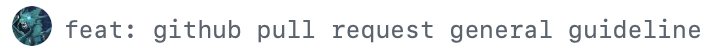

### Managing contributing branches

- Should create his contributing branches.

    The contributing branches are the working branches of the contributor—hence the ones into which his commits are pushed. They are typically created from a base branch, effectively producing a branch fork.

    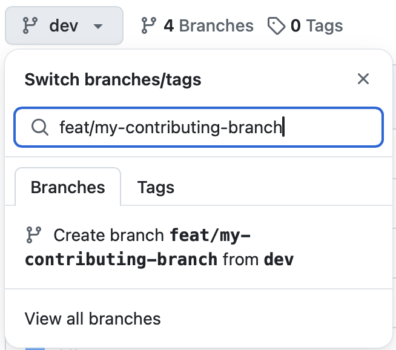

- Should push commits to his contributing branches in an exclusive manner.

    It is expected that each contributor upkeeps his own contributing branches, without intruding on the work of fellow contributors unless asked for.

### Managing pull requests

- Should create pull requests for his contributing branches as soon as conveniently possible, linking GitHub or Linear issues in their descriptions, correspondingly.

    The creation of a pull request signalizes the changes being worked on a contributing branch and unlocks the easy viewing (and reviewing) of all of its relevant commits, files, conversations and workflow runs; thus, doing it early streamlines development.

    

- Should assign his pull requests to himself.

    Assigning contributors to pull requests aids in rapidly visually recognizing who is taking care of which.

    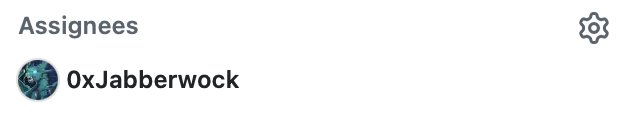

- Should mark his pull requests depending on their status.

    - If changes are meant to be merged, the pull request should be *open*.

    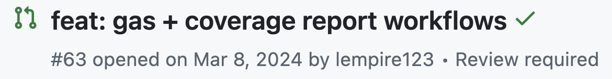

        - If the pull request is *open* and changes are approved by sufficient reviewers, the pull request should be *merged*.

        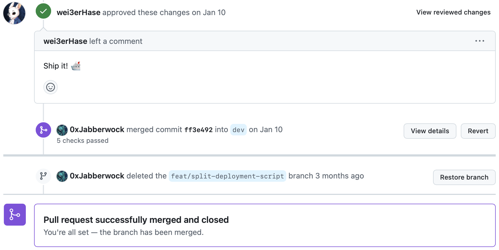

    - If changes are not meant to be merged but their underlying contribution is wanted and not merged, the pull request should be a *draft*.

    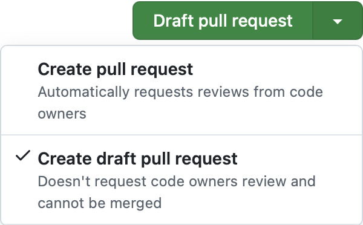

    - If changes are not meant to be merged and their underlying contribution is unwanted or merged, the pull request should be *closed*.

    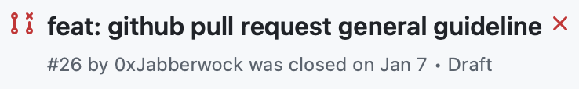

- Should minimize his pull requests.

    Minimal pull requests showcase only that what is necessary for the satisfactory completion of a single project task, without featuring extra changes out of scope.

- Should advance his pull requests towards completion.

    Ultimately, the goal of the contributor shall be to make his contributions effective, for which he takes active care of his work during its lifecycle.

### Managing reviews

- Should revise his changes before requesting (or re-requesting) reviewers.

    It is crucial for the contributor to take a new look at his work before reckoning his pull requests as ready for review.

- Should request (or re-request) appropriate reviewers whenever changes are ready for review (or re-review).

    The contributor is responsible for designating the reviewers of his pull requests and for notifying them about every review request. The selection of the reviewers shall be made in accordance with their suitability, with the aim of reaching meaningful feedback.

    

- Should address the reviewers' feedbacks, replying or reacting to their comments or conversations properly.

    In many cases, reviews will be left with suggestions that require further actions from the contributor, commonly code actualizations and/or answers. It is a good practice to link conversations to their resulting commits, pull requests, or GitHub or Linear issues, when applicable.

    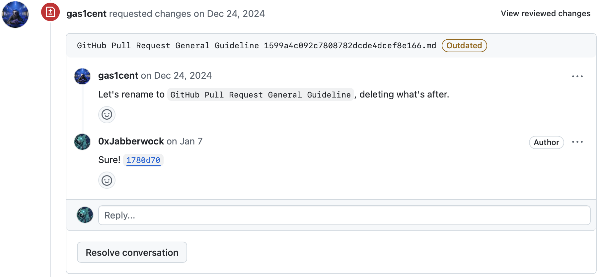

- Should not resolve (or edit, hide, or delete) reviewers' comments or conversations started by them.

    Let each reviewer re-review his feedback together with its replies, reactions and resulting contributions, if any, and decide whether it is due to resolve (or edit, hide, or delete) or not.

- May submit feedback to his pull requests in the form of resolvable comments or conversations, or reactions.

    The contributor is also able to limitedly review his changes—commenting on his work may prove to be valuable for himself or the reviewers.

    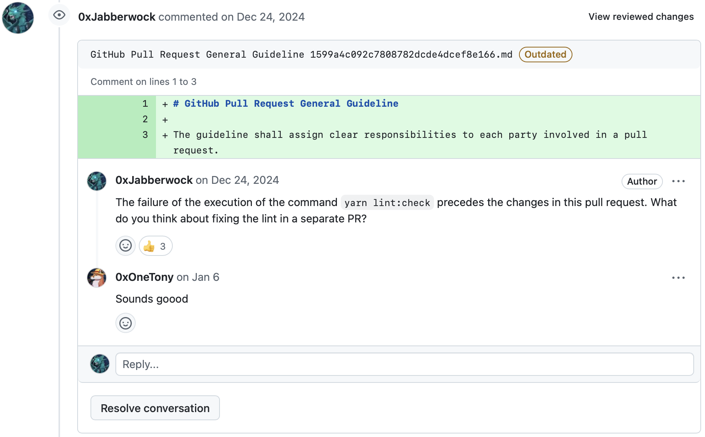

## Reviewer

A reviewer is whoever is requested to review a GitHub pull request, or otherwise reviews it without being the contributor. He is in charge of overseeing the changes of a pull request, reserving the ability to approve merging its commits.

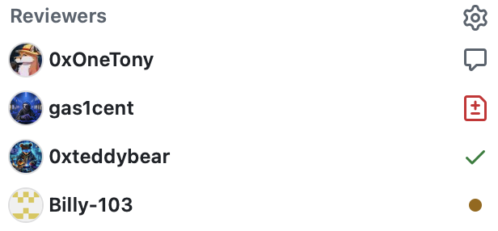

### Managing contributing branches

- Should not push commits to the reviewed contributing branches.

    It is considerate to let each contributor take care of his contribution, even if feedback has been given; notwithstanding the foregoing, reviewers may take over work when requested.

### Managing pull requests

- May mark the reviewed pull requests depending on their status.

    - If the pull request is *open* and changes are approved by sufficient reviewers, the pull request may be *merged*.

### Managing reviews

- Should submit feedback to the requesting pull requests in the form of resolvable comments or conversations, or reactions.

    - If changes are approved, he should be deemed as a **disengaged reviewer**, who is held accountable for such approval and considered to have been engaged.

    

    - If new changes are requested, he should be deemed as an **engaged reviewer**, who provides due follow-up of his feedback (delivered and to be delivered) until granting approval.

    

    - If changes are not approved and new changes are not requested, or have not been requested, he should be deemed as an **unengaged reviewer**, who is barely concerned about the address of his feedback and not about the merge of the pull request.

    

- Should resolve (or edit, hide, or delete) only his comments or conversations started by him, or leave them unresolved (or unhidden) for the matter of exposure, as appropriate.

    After having checked that his feedback was addressed to his satisfaction, the reviewer may prefer not to resolve in the presence of a sufficiently relevant discussion; otherwise, resolving hides that which is no longer useful.

    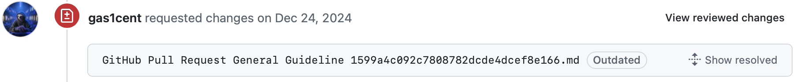

- Should not review without request.

    It is better to get into action in response to a call rather than at an unwanted moment.