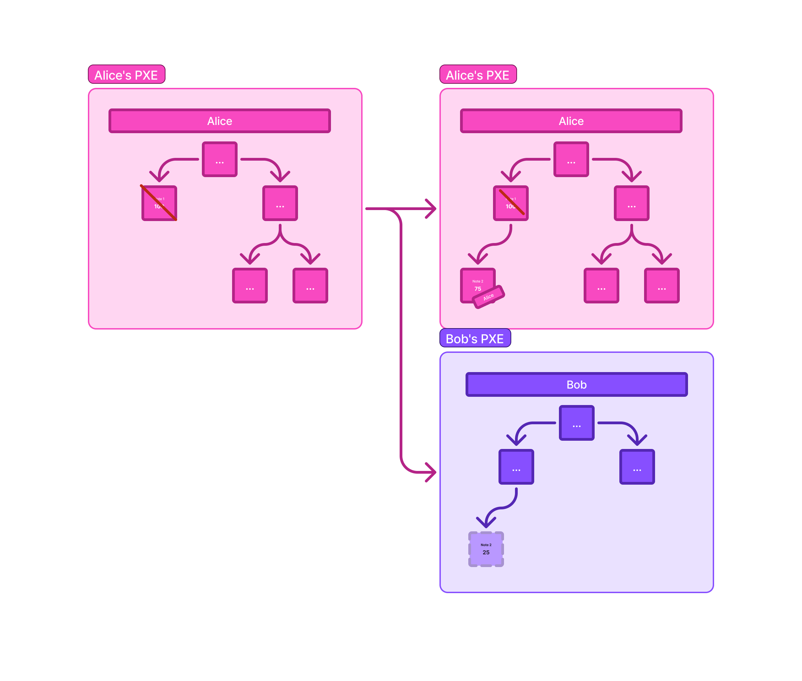
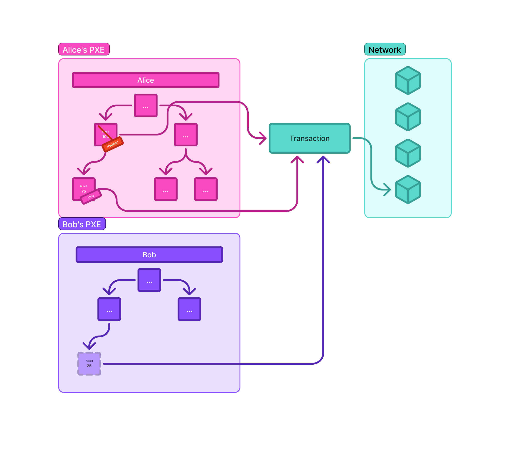
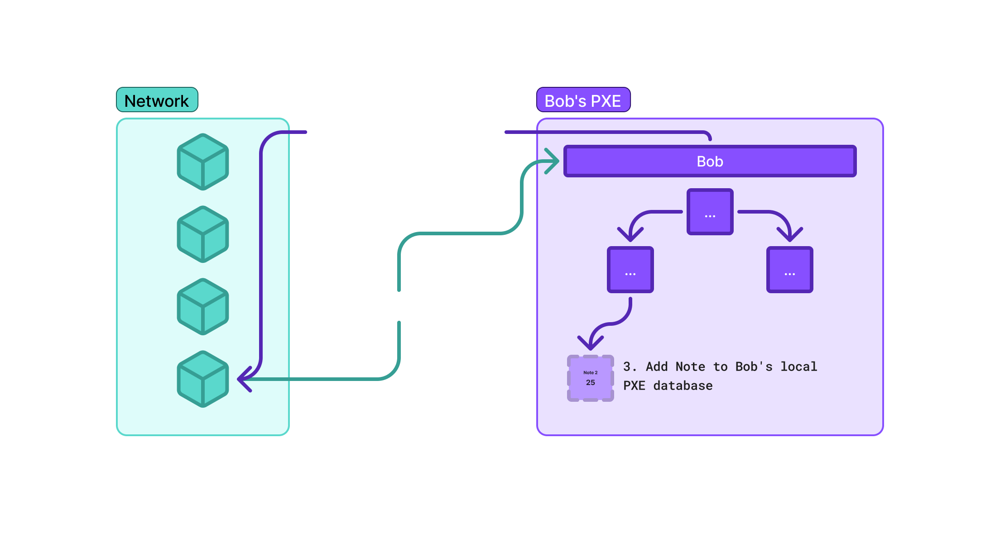

# Notes

:::warning
We will mention some concepts like **nullifiers** and **zero-knowledge circuits**, don't stress out if you don't grasp them right now; the following pages explain them in depth.
:::

A **Note** is a cryptographically committed, privately owned data object representing a discrete unit of value or state. It serves as the internal representation of a UTXO and is the atomic unit of private state within the system.

Unlike account-based models common in Ethereum, where each account is tied to a specific data location, the UTXO model ensures that each note explicitly specifies its owner. This design choice inherently decouples ownership from data location, thereby maintaining privacy. Notes are always **encrypted**, so their contents are only legible to their rightful owner.

## Properties 
Notes have certain properties essential for their operation and the  privacy guarantees:

- **Append Only**: Notes cannot be modified and they are always linked to a specific contract that can access them.

- **Cryptographically committed**: Notes themselves are never stored in their raw, unencrypted form directly on-chain. Instead, a cryptographic hash of the note, known as the note_commitment, is computed and stored. This commitment allows for verification of the note's existence and integrity without revealing its sensitive contents.

- **Encrypted and privately owned**: The actual note data is encrypted using the recipient's **public key**. This ensures that only the intended owner, possessing the corresponding secret viewing key, can decrypt and access the note's information.

- **Atomic unit of private state**: Each note represents a distinct, indivisible unit of value or state. When a change in state occurs (e.g. a transfer of funds), the old note is "consumed", and new notes are "created" to reflect the updated state.

- **Spendable via nullifiers**: To spend a note, its owner must cryptographically prove knowledge of the note's preimage (its original unencrypted data) and their private spending key. This process generates a unique, irreversible identifier called a nullifier. Once published, the nullifier prevents the same note from being spent more than once, effectively marking it as consumed.

- **No location-based relationship**: In this UTXO model, the ownership of a note is explicitly embedded within the note's data itself, rather than being implied by its storage location within a data tree. This contributes to the system's privacy by making it harder to link notes to specific accounts based on public data structures.

## The Note Hash Tree
Instead of storing entire notes on-chain, only their `note_commitments` are inserted into a specialized Merkle tree called the note hash tree. This tree serves as a public record of all valid note commitments, allowing for efficient inclusion proofs. Users can prove that a specific note commitment exists within the tree without revealing the note's sensitive details.

## Anatomy of a Note
Aztec.nr, the smart contract language for Aztec, simplifies the definition and management of notes through the `#[note]` attribute. When a struct is annotated with `#[note]`, the Aztec.nr macro automatically generates the necessary implementations for the NoteType, NoteHash, and Packable traits, providing the cryptographic functions required for notes to function within the protocol.

:::warning
This is a simplified example to illustrate the core concept. The actual implementation of note structs in Aztec.nr can be more complex, including additional fields relevant to specific contract logic.
:::

A conceptual representation of a custom note struct in Aztec.nr might look like this:

```rust
#[note]
struct CustomNote {
    data: Field,
    owner: Address,
}
```

:::note reference
See [this file](https://github.com/AztecProtocol/aztec-packages/blob/2b9c409698cf0f475a7a9f5884117c8ad2a4f79a/noir-projects/aztec-nr/aztec/src/macros/notes.nr#L351) for further reference.
:::

## Note Commitment Calculation (`compute_note_hash`)
The `compute_note_hash` method, auto-generated by the `#[note]` macro, calculates this commitment. It typically involves hashing the serialized note data along with its `storage_slot`:

```rust
impl NoteHash for CustomNote {
    fn compute_note_hash(self, storage_slot: Field) -> Field {
        let inputs = array_concat(self.pack(), [storage_slot]);
        poseidon2_hash_with_separator(inputs, GENERATOR_INDEX__NOTE_HASH)
    }
    //...
}
```

:::note reference
For further information, refer to [this file](https://github.com/AztecProtocol/aztec-packages/blob/47c749527b1c3cce3edd9defedc46e89ea00c69e/noir-projects/aztec-nr/aztec/src/macros/notes.nr#L356-L386).
:::

Here, `self.pack()` serializes the note's internal fields into an array of Field elements. This array, combined with the `storage_slot`, is then hashed using `poseidon2_hash_with_separator`, and a `GENERATOR_INDEX__NOTE_HASH` which ensures domain separation for note commitments.


## Nullifier Generation (`compute_nullifier`)
The nullifier is essential for preventing double-spending and is also auto-generated by the `#[note]` macro. It's derived from the `note_hash_for_nullify` (a value closely related to the note commitment) and a secret that is known only to the note's owner and derived from their Nullifier Secret Key (NSK).
```rust
impl NoteHash for CustomNote {
    // ...
    fn compute_nullifier(self, context: &mut PrivateContext, note_hash_for_nullify: Field) -> Field {
        // Ensure the note data includes the owner to derive the owner's public key hash
        let owner_npk_m_hash = get_public_keys(self.owner).npk_m.hash();
        
        // Retrieves a secret derived from the owner's NSK
        let secret = context.request_nsk_app(owner_npk_m_hash); 
        
        poseidon2_hash_with_separator(
            [
                // Hash value based on the note's commitment
                note_hash_for_nullify, 
                // Secret known only to the owner
                secret 
            ],
            GENERATOR_INDEX__NOTE_NULLIFIER as Field
        )
    }
    // ...
}
```
:::tip Tip
Notice that this is only achievable if the Note data includes the owner
:::

The `owner_npk_m_hash` is a hash of the owner's nullifier public key material, which is used to request the secret from the user's Private Execution Environment (PXE). This secret is then combined with the `note_hash_for_nullify` and hashed using `poseidon2_hash_with_separator` (with `GENERATOR_INDEX__NOTE_NULLIFIER` for domain separation) to produce the unique nullifier. This design ensures that only the rightful owner can generate the correct nullifier for their note.

:::note 
Note that only the owner can know what the nullifier is, and he/she can prove (with his/her `owner_npk_m_hash`) the correctness of it, in order to avoid double-spending the same note with 2 nullifiers.
:::

## Note Lifecycle

The journey of a Note involves the following stages:

- **Creation**: A note is created when a private function within an Aztec smart contract emits it as part of a transaction. The `#[private]` attribute on such a function indicates it operates on private information and will generate a zero-knowledge circuit. The contents of the newly created note are encrypted using the recipient's public key, ensuring its confidentiality.

- **Commitment and Insertion**: Once a note is created, its `note_commitment` (the cryptographic hash) is computed. This commitment, but not the encrypted note data itself, is then inserted into the global note hash tree on-chain. This step makes the note's existence publicly verifiable without revealing its private details.

- **Note Discovery:** One of the primary challenges in UTXO models is for users to efficiently identify and decrypt the notes that belong to them without downloading and brute-forcing decryption attempts on the entire blockchain.

The challenge here is that traditional approaches like trial-decrypting all notes become computationally expensive as the network grows and can introduce reliance on third-party servers. Off-band communication for note delivery, while efficient, introduces reliance on side channels.

The solution to this is **note tagging**. When a note is created, the sender generates a unique *"tag"* for the log in which the note is embedded. This tag is derived from a shared secret between the sender and recipient, along with a shared index (a counter that increments with each note exchanged between them). Critically, only the sender and recipient can identify this tag. The Aztec node exposes an API (`getLogsByTags()`) that allows users to efficiently query logs matching specific tags, significantly streamlining note discovery. Aztec.nr further abstracts this for developers, allowing for custom note types and discovery methods.

There are some limitations to this, like the inability to receive notes from unknown senders (as a shared secret cannot be established), and complexities with index synchronization if transactions are reverted or unexpectedly ordered.

## Spending (Nullification):
When the owner of a note wishes to spend it, they initiate a private transaction. Within a private zero-knowledge circuit (we will define this concept later), the owner provides the note's full preimage (the original, unencrypted note data) and their private spending key. 

Using the `compute_nullifier` function, a unique nullifier for that specific note is derived. This nullifier is then published on-chain and inserted into a global nullifier tree.

Once a note's nullifier is published and included in the nullifier tree, that note is permanently marked as "spent". Any subsequent attempt to use the same note will fail because its corresponding nullifier will already be present in the tree. 

A key aspect of the UTXO model is that spending a note often involves creating one or more new notes. For example, if a user spends a larger note to make a smaller payment, the original note is nullified, and two new notes are created: one for the recipient (the payment) and one for the sender (the "change"). This mechanism elegantly decouples the actions of creating, updating, and deleting private state.

## Private Payment Example

Now, an example of a private payment: let's say that Alice wants to pay Bob 25 DAI privately. In a highlevel:

### Sender's Action (Alice):

Alice currently holds a larger DAI note, for instance, a 100 DAI note. To send 25 DAI to Bob, her private circuit first nullifies her existing 100 DAI note by generating and publishing its nullifier to the nullifier tree.

Simultaneously, Alice's circuit creates two new notes:

- A 25 DAI note, specifically encrypted to Bob's public key and tagged for Bob's discovery.

- A 75 DAI "change" note, encrypted back to Alice's own public key.



The commitments for these two newly created notes, along with the nullifier of the original 100 DAI note, are included in the transaction and posted on-chain.



### Recipient's Action (Bob):

Bob's PXE continuously monitors the network for encrypted logs. It specifically looks for logs that are "tagged" using the shared secret and index scheme established between him and Alice.

Upon finding the encrypted log containing the 25 DAI note, Bob's PXE decrypts it using his secret viewing key.

The decrypted 25 DAI note is then added to Bob's local PXE database, making it available for future spending.



### Spending the Received Note (Bob):

Later, when Bob wishes to spend his 25 DAI note (e.g. to pay Karl), he initiates a new private transaction.

- His PXE provides the note's preimage and his private spending key to his private circuit.

- A unique nullifier for that 25 DAI note is computed and published to the nullifier tree, marking it as spent.

Similar to Alice's action, Bob's circuit would then create new notes (e.g. a payment note for Carol and a change note for Bob himself) as part of this transaction.