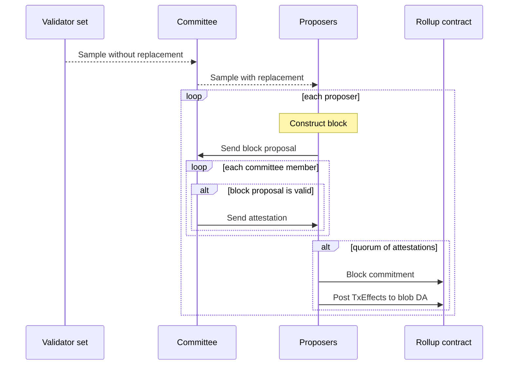

# Sequencing

Each epoch is sequenced *without proving* until it is complete. Such chain of unproven blocks is
called the *pending chain*, which is dispatched for proving only after it's been completely
sequenced.

The sequencing of an epoch can be summarized in the following steps



Each proposer must catch up to the previous proposer before they start constructing their own
blocks.

## Epoch initialization

At the start of an epoch, a committee is elected pseudorandomly, along with the set of committee
members that will act as proposers. Randomness is sampled from randao at a previous epoch and a
random seed derived from it:

```solidity
seed = uint256(keccak256(abi.encode(epoch, randao[epoch-2])))
```

The sampling occurs as follows:
- **Committee**: Draw `TARGET_COMMITTEE_SIZE` indices pseudorandomly *without replacement*. At the
  time of writing, this is done with a Fisher-Yates shuffle algorithm.
- **Proposers**: Draw 32 indices from the committee *with replacement*.

### Validator lookahead

The validator set used to compute the committee at epoch $$N$$ is taken from a snapshot of the
validator set at 1 second before the start of epoch $$N-1$$. Since the randao value used for seed
generation is that of epoch $$N-2$$, this means the committee and proposers are known one full epoch
in advance.

## Block building

Inside an epoch, slots are filled in sequence. Each slot's assigned proposer waits for all previous
blocks to be committed to in the rollup contract. They'll then catch their state up with the latest
committed state and begin their own block construction and proposal.

The proposer collects enough `Tx` objects from their view of the mempool to sequence a valid block.
For any TX ordering, the proposer can simulate their execution *without proving* to know what state
changes are introduced by the resulting block. After settling for one specific list of TXs, the
proposer uses the simulation's results to construct a `BlockProposal`, consisting of:
- `blockNumber`: the block number
- `signature`: the proposal's signature by the proposer
- `payload`: what the signature is over
  - block header, including the archive root after this block is added
  - archive root after block
  - state after block
- `txHashes`: TX hashes
- `txs`: (optional) the block's complete transaction data

:::note
The archive tree is a tree whose leaves are the previous blocks' headers
:::

The proposer then forwards the proposal to the committee in order to collect attestations.

## Block propagation

Just like with transactions, all nodes re-broadcast block proposals to their known peers after a
basic *P2P validity check*.

This check currently ensures:
- A committee has been defined in the rollup contract for the slot the proposal belongs to
- The proposal is for either the current or the next slot
- The proposer is the correct one for the slot

## Proposal attestation

When a commitee member receives a block proposal, they should verify the proposal and send a
`BlockAttestation` back to the proposer. This verification includes the P2P validity check, as well
as checks that the proposal is consistent with the previous known state, and the proposed block
executes correctly.

In detail, the consistency checks are:
- The block previous to the proposal is known
- The proposal's *previous* archive root matches the previous block's archive root
- The L1->L2 messages in the proposal match the ones in the rollup contract

:::note
As commented in the code, some of the attestation checks may be promoted to P2P validity checks,
tightening the gossip checks.
:::

If all check pass, the attester sends the proposer a `BlockAttestation`, consisting of the same
`blockNumber` and `payload` as the proposal, as well as the attester's `signature`.

## On-chain block commitment

After reciving the quorum of attestations, the block producer will submit their block proposal to
the L1 contract by calling `RollupCore::propose` with:
- `ProposeArgs` object that includes the proposed block's header
- The committee attestations
- Data for blob DA

At this point, the rollup contract will prune any epochs that failed to prove. It will then validate
the proposal in order to add it to the pending chain.


## Catching-up with the latest block

## TODOs

- [ ] On-chain block commitment: what's in `_blobsInput`?
- [ ] On-chain block commitment: What will the proposer publish?
- [ ] On-chain block commitment: What checks does the contract perform?
- [ ] Catching-up with the latest block
- [ ] Check whether the contract checks `proposer = proposers[slot]`

## References

### Source code

- [Committee computation](https://github.com/AztecProtocol/aztec-packages/blob/v2.0.0-nightly.20250820/l1-contracts/src/core/libraries/crypto/SampleLib.sol#L33)
- [Proposer sampling](https://github.com/AztecProtocol/aztec-packages/blob/v2.0.0-nightly.20250820/l1-contracts/src/core/libraries/rollup/ValidatorSelectionLib.sol#L381)
- [Block proposal](https://github.com/AztecProtocol/aztec-packages/blob/v2.0.0-nightly.20250820/yarn-project/stdlib/src/p2p/block_proposal.ts#L37)
- [P2P validity check](https://github.com/AztecProtocol/aztec-packages/blob/v2.0.0-nightly.20250820/yarn-project/p2p/src/msg_validators/block_proposal_validator/block_proposal_validator.ts#L15)
- [Attesting function](https://github.com/AztecProtocol/aztec-packages/blob/v2.0.0-nightly.20250820/yarn-project/validator-client/src/validator.ts#L251)
- [Rollup core](https://github.com/AztecProtocol/aztec-packages/blob/v2.0.0-nightly.20250820/l1-contracts/src/core/RollupCore.sol)
