# Sequencing

The sequencing of an epoch can be summarized in the following steps

```mermaid
sequenceDiagram
    Validator set-->>Committee: Sample without replacement
    Committee-->>Proposers: Sample with replacement
    loop each proposer
        Note over Proposers: Construct block
        Proposers->>Committee: Send block proposal
        loop each committee member
            alt block proposal is valid
                Committee->>Proposers: Send attestation
            end
        end
        alt quorum of attestations
            Proposers->>Rollup contract: Block commitment
            Proposers->>Rollup contract: Post TxEffects to blob DA
        end
    end
```



Each proposer must catch up to the previous proposer before they start constructing their own
blocks.

## Epoch initialization

At the start of an epoch, a committee is ellected pseudorandomly, along with the set of committee
members that will act as proposers. Randomness is sampled from randao at a previous epoch and a
random seed derived from it:

```solidity
seed = uint256(keccak256(abi.encode(epoch, randao[epoch-2])))
```

The sampling occurs as follows:
- **Committee**: Draw `TARGET_COMMITTEE_SIZE` indices pseudorandomly *without replacement*. At the
  time of writing this is done with a Fisher-Yates shuffle algorithm.
- **Proposers**: Draw 32 indices from the committee *with replacement*.

### Validator lookahead

The validator set used to compute the committee at epoch $$N$$ is taken from a snapshot of the
validator set at 1 second before the start of epoch $$N-1$$. Since the randao value used for seed
generation is that of epoch $$N-2$$, this means the committee and proposers are known one full epoch
in advance.

## Block building and proposal atestation

The proposer collects enough `Tx` objects from their view of the mempool and sequences a valid
block. After this, they construct a `BlockProposal`, constituting of:
- `blockNumber`: the block number
- `payload`: what the signature is over, consisting of block header, archive root after block, and
  state after block
- `signature`: the proposal's signature by the proposer
- `txHashes`: TX hashes
- `txs`: (optional) the block's complete transaction data

:::note
The archive tree is a tree whose leaves are the previous blocks' headers
:::

The proposer then forwards the proposal to the committee in order to collect atestations. When a
commitee member receives a block proposal, they can send a signature for the proposal back to the
proposer.

A lawful commitee member will check for correctness before signing: the changes in state must
correspond to the `txHashes` in the proposals.

## On-chain block commitment

After reciving the quorum of attestations, the block producer will:
- Post the TX effects to blob DA
- Post the attestment signatures, block header, and state root to the L1 rollup contract

The rollup contract in turn will perform checks
TODO

## References

### Source code

- [Committee computation](https://github.com/AztecProtocol/aztec-packages/blob/286fbfae25b173d372164eedd7b22926eac32b2a/l1-contracts/src/core/libraries/crypto/SampleLib.sol#L33)
- [Proposer sampling](https://github.com/AztecProtocol/aztec-packages/blob/286fbfae25b173d372164eedd7b22926eac32b2a/l1-contracts/src/core/libraries/rollup/ValidatorSelectionLib.sol#L381)
- [Block proposal](https://github.com/AztecProtocol/aztec-packages/blob/286fbfae25b173d372164eedd7b22926eac32b2a/yarn-project/stdlib/src/p2p/block_proposal.ts#L37)
