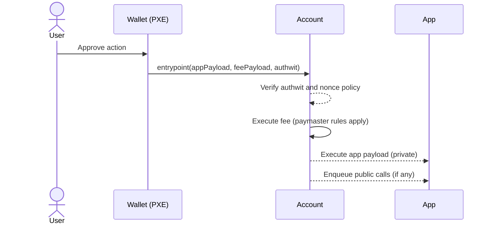

# Account contracts

Account contracts are the user’s control plane. They own identity and policy: how an action is authorized, how replay is prevented, who pays fees and under what rules, and whether a request is allowed to run. The protocol is generic, the account sets the rules.

## What the account owns

An account owns identity and policy. It verifies an authentication witness for a specific, domain‑separated message; applies its nonce policy to prevent replay and enforce ordering; and decides who pays fees and under what rules. Every request therefore flows through the account’s rules: the fee payload runs first, the app payload runs second, and if any invariant fails the whole request reverts.

## From user intent to execution



## Authorization (is_valid_impl)

`is_valid_impl(message_hash)` defines the account’s authentication policy and returns the `IS_VALID` selector on success. Use whatever scheme fits your UX, Schnorr or ECDSA signatures, WebAuthn, MFA, or checks against an external keystore, but always authorize a domain‑separated message. That message should fix the chain id and account address, the entrypoint selector, commitments to the app and fee payloads, the nonce scope and value (with an optional expiry), and any sponsor/paymaster context. The resulting authwit should be single‑use and short‑lived to minimize replay risk; see [`authwit`](/docs/contracts/account-contracts/authwit) for flows and single‑use patterns.

Where you keep the verifying public key determines your rotation and cost model. A private note is flexible and rotatable but adds nullifier/commitment churn whenever you read it. An immutable private note removes that churn but cannot rotate. Delayed public mutable state allows rotation with bounded staleness (a TTL window). A separate keystore contract keeps the account surface small at the price of an extra private lookup per call.

## Fees and nonces

Keep fee policy inside the account, paymasters can sponsor, but the account decides when a request is properly funded. Always execute the fee payload before the app payload so sponsorship or gas‑policy failures abort early.

For nonces, pick a policy that matches UX and risk. A global monotonic counter gives simple ordering and easy cancellation via bumping. Scoped nonces (per app or per spender) avoid cross‑app blocking at the cost of tracking multiple cursors. For cancellable flows, emit a transaction nullifier tied to the pending request and check it in `entrypoint` to void prior intents. The protocol guarantees unique transaction hashes; the account enforces the intended semantics on top.

## Address derivation and keys

Aztec addresses are not random; they are commitments to both code and keys. This gives every account a stable identity that proves “this code with these keys” is behind the address. The PXE derives and manages the keys; the protocol derives the address.

### How an address is formed (step‑by‑step)

1) Code fingerprint
   - `contract_class_id = poseidon2(artifact_hash, fn_tree_root, public_bytecode_commitment)`
   - Captures function VKs/selectors and any public bytecode commitment

2) Initialization fingerprint
   - `salted_initialization_hash = poseidon2(deployer_address, salt, constructor_hash)`
   - Binds constructor selector/args, deployer, and a salt for uniqueness

3) Partial address
   - `partial_address = poseidon2(contract_class_id, salted_initialization_hash)`

4) Keys fingerprint
   - `public_keys_hash = poseidon2(Npk_m, Ivpk_m, Ovpk_m, Tpk_m)`
   - `Ovpk` and `Tpk` exist for extensibility; current protocol chiefly relies on `Npk_m` (nullifier) and `Ivpk_m` (incoming viewing)

5) Address preimage
   - `pre_address = poseidon2(public_keys_hash, partial_address)`

6) Address key and public key
   - `address_sk = pre_address + ivsk`
   - `AddressPublicKey = address_sk * G`

7) Final address
   - `address = x(AddressPublicKey)`

```solidity
contract_class_id           = poseidon2(artifact_hash, fn_tree_root, public_bytecode_commitment)
salted_initialization_hash  = poseidon2(deployer_address, salt, constructor_hash)
partial_address             = poseidon2(contract_class_id, salted_initialization_hash)
public_keys_hash            = poseidon2(Npk_m, Ivpk_m, Ovpk_m, Tpk_m)
pre_address                 = poseidon2(public_keys_hash, partial_address)
address_sk                  = pre_address + ivsk
AddressPublicKey            = address_sk * G
address                     = x(AddressPublicKey)
```

Why add `ivsk` into the address key? It enables ECDH with `AddressPublicKey` so senders can encrypt notes for a recipient using just the address, while only the recipient can decrypt via `address_sk`.

Some of the consequences are:
- Nullifier, viewing, and address keys are embedded in the address. Rotating them changes the address; design rotation only for signing keys.
- Any change in code (class) or constructor preimage yields a different address by construction.

### App‑siloed keys (PXE)

To minimize blast radius and enable per‑app auditability, the PXE derives per‑contract keys. For example:
`nsk_app = H(nsk_m, app_address)`

Applications can audit a user by verifying the app‑scoped viewing key for that one contract, without learning anything about activity in others.

:::note 
Note that the following sections provide overviews. For a more in-depth explanation, see [aztec-packages](https://github.com/AztecProtocol/aztec-packages).
:::

### Diversified and stealth addresses

Users can precompute deterministic addresses bound to diversified/stealth public keys and receive funds before deployment. A light account contract can later be deployed that delegates `entrypoint` control back to the master account while preserving the diversified address history.

### Registry

Accounts can publish encryption/tagging keys and precompile preferences in a public registry that apps read via archive‑tree proofs. This lets senders learn where to encrypt for an address even if the account has not interacted with them before.

## Wallets and PXE

Wallets embed the PXE and act as the interface between a user and their account. The PXE generates and stores keys, trial‑decrypts notes, and proves private execution. On top, the wallet implements an `AccountInterface` that formats the app and fee payloads, produces the authwit for a given message, and exposes a PXE API to dapps. In signerless flows where an app can be invoked directly as origin, the wallet may call the app without routing through the account, but fees must still be explicit, typically via sponsorship.

## Using accounts from dapps

Dapps build an execution request addressed to the user’s account (the origin). The request carries the function data (selector and privacy), an arguments hash for what will be executed, and a transaction context with chain id, version, and gas settings. The lifecycle is: build calls and prompt the user; the PXE simulates privately and produces proofs; the sequencer verifies proofs and enqueues any public calls; the rollup settles to L1. You can batch multiple calls via `aztec.js` helpers. Account creation follows the same pattern: deploy if you need public functions, let the PXE seed keys, and have the wallet format requests and produce authwits.

## Contracts vs apps

Keep accounts opinionated and apps simple. The account owns identity, authorization, nonces, and fee policy, and routes payloads; the app owns business logic and state transitions. Prefer lean app functions and use PXE oracles for accessing private data. For self‑contained flows an app can be invoked as origin, but fee handling must still be explicit.

## Invariants, pitfalls, tests

Invariants. Fee‑first execution, a robust nonce policy, and strong domain separation must always hold. If any of these break, the entire request should revert.

Pitfalls. Avoid authorizing raw calldata instead of a structured, domain‑separated message. Don’t forget expiry or cancellable semantics for user intents. Choose a signing‑key storage strategy that matches your rotation needs to avoid either being stuck or churning private state unnecessarily.

Testing. Accept valid authwits and reject mismatches across chain/account/selector/args/fee/expiry. Prove that fee‑first execution is enforced and that failures revert atomically. Exercise nonce policy edges (scoped, bump, cancel). Verify sponsor/paymaster rules and any key‑rotation and recovery paths.

## References

- Keys: https://github.com/AztecProtocol/aztec-packages/blob/master/docs/docs/aztec/concepts/accounts/keys.md
- Account helper: https://github.com/AztecProtocol/aztec-packages/blob/master/noir-projects/aztec-nr/aztec/src/authwit/account.nr
- Contract creation: https://github.com/AztecProtocol/aztec-packages/blob/master/docs/docs/aztec/smart_contracts/contract_creation.md

### Library references (source)

- [aztec-nr core (macros, state vars, authwit, context](https://github.com/AztecProtocol/aztec-packages/tree/master/noir-projects/aztec-nr/aztec)
- [easy-private-state (helpers for working with private notes/sets)](https://github.com/AztecProtocol/aztec-packages/tree/master/noir-projects/aztec-nr/easy-private-state)

### Account contract implementations (examples)

- [Schnorr account (production-style example)](https://github.com/AztecProtocol/aztec-packages/tree/master/noir-projects/noir-contracts/contracts/account/schnorr_account_contract)
- [Schnorr hardcoded key (didactic, not for production)](https://github.com/AztecProtocol/aztec-packages/tree/master/noir-projects/noir-contracts/contracts/account/schnorr_hardcoded_account_contract)
-[ Schnorr single-key variant (simplified pattern)](https://github.com/AztecProtocol/aztec-packages/tree/master/noir-projects/noir-contracts/contracts/account/schnorr_single_key_account_contract)
- [ECDSA-based accounts (example implementations)](https://github.com/AztecProtocol/aztec-packages/tree/master/noir-projects/noir-contracts/contracts/account/ecdsa_k_account_contract)
- [Simulated account (testing/support contract)](https://github.com/AztecProtocol/aztec-packages/tree/master/noir-projects/noir-contracts/contracts/account/simulated_account_contract)

