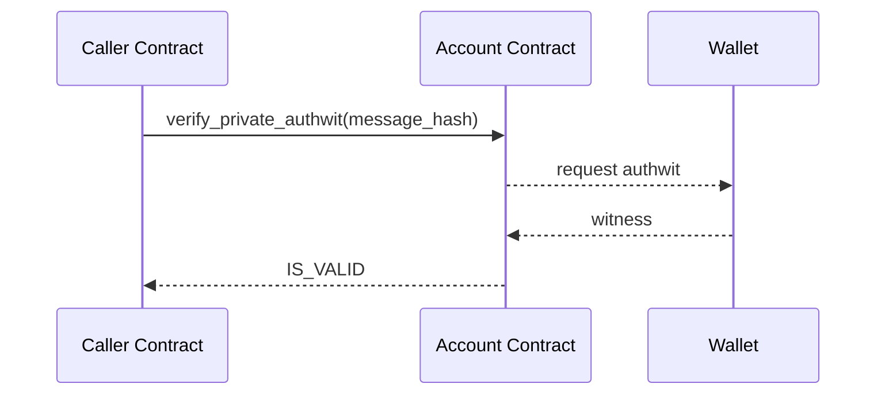

# Authentication witnesses (authwits)

An authwit is a proof that “this account approved this exact request under these conditions”. The wallet creates it, the account verifies it inside `entrypoint`, and the request proceeds only if the witness is valid for the current scope and nonce policy. Good authwits are narrowly scoped, time‑bounded, and single‑use.

## The message you authorize

Always authorize a domain‑separated message. A practical shape is:

```text
hash(
  chain_id,
  account: AztecAddress,
  entrypoint_selector,
  app_payload_commitment,
  fee_payload_commitment,
  nonce_scope,
  nonce_value,
  expiry?,
  sponsor_context?
)
```
Notes:
- Commit to payloads, not raw calldata.
- Include a scoped nonce (and optional expiry) to bound replay.
- If a sponsor/paymaster is involved, bind that context as well.

## Private verification flow

1) A caller contract asks the account to check an authwit for the inner message.
2) The wallet computes the message hash locally and returns the witness to the PXE.
3) The account validates and returns the `IS_VALID` selector, the caller continues.



## Public verification flow

Some flows are verified publicly via a registry. The account (or wallet) writes a public authorization flag keyed by the message hash; the caller then checks `assert_current_call_valid_authwit_public` which consumes the flag to prevent reuse.

## Single-use and nonces

Make witnesses single‑use. A common recipe is to emit a nullifier derived from the message hash when the request succeeds; a second attempt with the same witness then fails. If you expect the same logical action to be repeated, change the `nonce_value` (or add `expiry`) so each approval is unique.

## Quick checklist

- Domain‑separate the message, commit to both payloads
- Scope and bind the nonce, add an expiry when useful
- Mark success by emitting a nullifier and/or consuming a public flag
- Verify sponsor/paymaster context if you support sponsorship

## Common pitfalls

- Authorizing raw calldata instead of a structured, domain‑separated message
- Reusing witnesses (no single‑use guard) or forgetting expiry
- Not binding the fee/sponsor context while relying on sponsorship

## References

- Concepts: [concepts/advanced/authwit.md](https://github.com/AztecProtocol/aztec-packages/blob/master/docs/docs/aztec/concepts/advanced/authwit.md)
- Noir helper (verify + entrypoint): [aztec-nr/aztec/src/authwit/account.nr](https://github.com/AztecProtocol/aztec-packages/blob/master/noir-projects/aztec-nr/aztec/src/authwit/account.nr)
- Contract utilities/macros: [guides/smart_contracts/writing_contracts/authwit.md](https://github.com/AztecProtocol/aztec-packages/blob/master/docs/docs/developers/guides/smart_contracts/writing_contracts/authwit.md)
- JS utils and examples: [guides/js_apps/authwit.md](https://github.com/AztecProtocol/aztec-packages/blob/master/docs/docs/developers/guides/js_apps/authwit.md)
