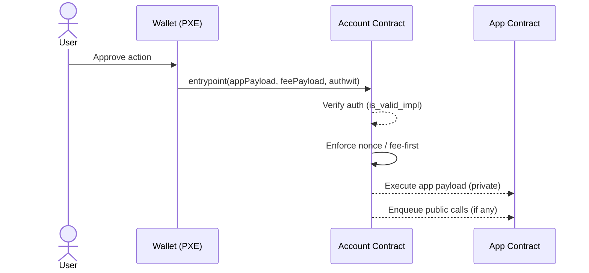

# Overview

Aztec makes the user’s account a contract. That contract, not the protocol, decides how to authenticate a request, how to pay fees, which nonces to use, and under what rules an action is allowed. Wallets prepare requests; accounts verify and execute; application contracts stay focused on domain logic. This section tells that story end‑to‑end so you can design and build accounts confidently.

## What you’ll learn

- Why auth, fees, and nonces live in accounts (not apps or the protocol)
- How the account `entrypoint` consumes two payloads (app and fee) in a strict order
- How wallets (PXE) create authentication witnesses and provide private data via oracles
- When to require an authwit versus relying on app contract checks
- How account contracts differ from “dumb” application contracts

## The narrative: from intent to execution

1) The user approves an action in the wallet. The wallet formats two payloads: the app payload (what to call) and the fee payload (how to pay). It then produces an authentication witness associated to the payload.

2) The request is sent to the user’s account contract (the origin). Inside `entrypoint`, the account verifies the authwit, checks replay protection (nonce policy), ensures that the fee payload executes non-reversibly, and executes the app payload.

3) Private execution happens locally in the PXE; only commitments, nullifiers, and public calls leave the client. Public calls are queued and executed publicly, keeping private and public state consistent.

## Core responsibilities of an account

- Authorization: verify authwits according to the account’s chosen scheme (Schnorr, ECDSA, WebAuthn, MFA, etc.)
- Replay protection: define and enforce a nonce policy suitable for the account’s UX and risk model
- Fee policy: decide who pays, how much, and under what sponsorship rules
- Execution rules: ensure fee executes first, then app, and fail safely if any invariant breaks

## Design principles

- Keep authorization and fee logic in the account; keep application contracts simple and explicit
- Use PXE oracles for private data access; don’t pass secrets through app contracts
- Prefer single‑use, scoped authwits that are time‑bound and domain‑separated

## By the end, you should be able to answer

- What makes an action authorized for a given account?
- Why does the fee payload execute before the app payload?
- When should an app require an authwit versus checking its own invariants?
- How do wallets, accounts, and apps divide responsibilities cleanly?

Next up: developing accounts, using accounts in apps, accounts vs application contracts, PXE integration, and authwits in practice.

