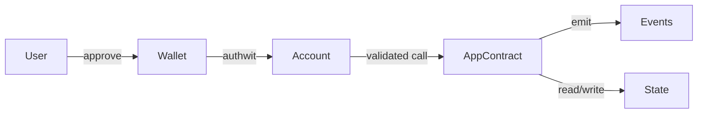

# Overview

Dumb contracts encapsulate app logic and state. They do not decide who a user is or whether a user approved something, that is the account’s job. This separation keeps apps simple and auditable while letting wallets and accounts implement rich auth and fee policies.

## What you’ll learn in this section

- How to structure app contracts so they stay “dumb” and correct
- When to use private vs public functions, and how they interact
- How to think about state visibility and data flow on Aztec
- Pointers to real app examples you can read and run

## Design principles (at a glance)

- Keep auth and fees out of apps, rely on the user’s account `entrypoint`
- Split private/public logic intentionally; use PXE oracles to read private data
- Keep state minimal and explicit; prefer events and selectors that are easy to audit
- For user approvals, use authwits rather than bespoke signatures

## Typical module split

Continue with examples and patterns as this section evolves.