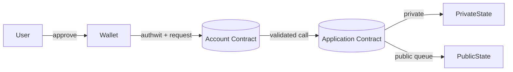

# Overview

This section introduces Aztec contracts across three areas and links to their docs:

- Account contracts: native account abstraction, entrypoints, auth, fees, nonces, PXE integration
- Dumb (application) contracts: public/private functions, state visibility, design principles
- Standards (Wonderland): token and NFT specs and references

Start with Account Contracts to understand identity, authorization, and fee mechanics. Then move to Dumb Contracts and the Standards.

Key insights you need before diving in:

- Accounts and keys
  - Every user account is a contract with pluggable auth, nonce, and fee logic.
  - Wallets manage multiple keys and secrets, producing authentication witnesses (authwits) to authorize actions.
  - Addresses and note keys are derived in a wallet-managed PXE; apps should never implement their own key math.

- Transactions lifecycle
  - Private execution is simulated and proven locally; only commitments/nullifiers/public calls leave the client.
  - Public calls are enqueued and executed on L2; private and public states stay consistent via the kernel rules.
  - The request sent to the node includes proofs, authwits, and any public data needed for verification.

- Wallet architecture (PXE)
  - The PXE stores keys, notes, and nullifiers; it provides oracles so private functions can query user secrets.
  - Wallets format execution requests against the user’s account contract and attach the right authwits/fees.

- Contract creation
  - Deploy artifacts contain both private and public entrypoints; initialization can span private and public steps.
  - Prefer thin application contracts: keep authorization in accounts; apps focus on domain state and events.

Quick picture of how pieces fit together:

