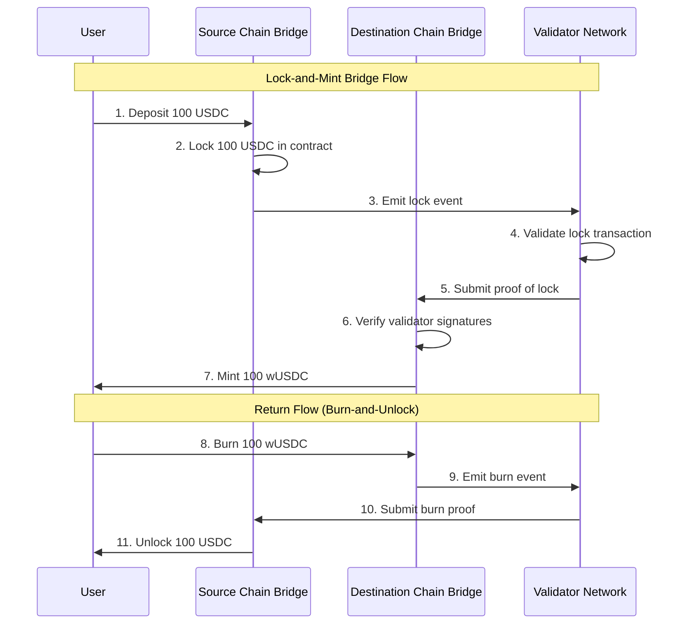
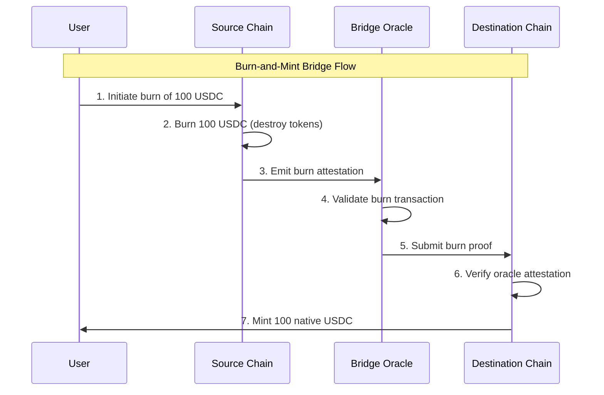
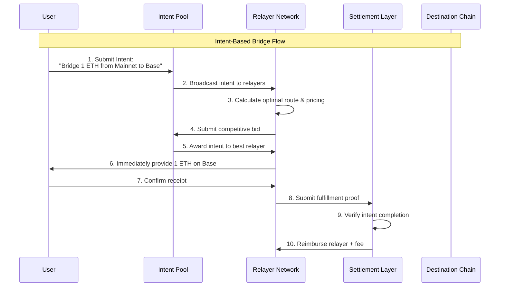
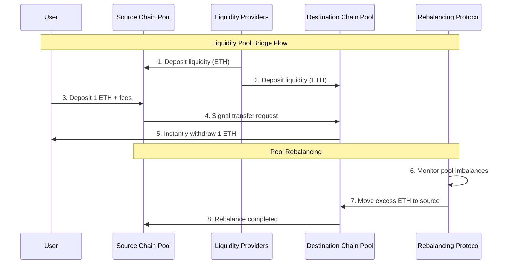

# Bridges

The blockchain world has evolved dramatically. What started with Bitcoin's simple value transfers has exploded into a diverse ecosystem where multiple chains compete and specialize. We have Ethereum's security and composability, Solana's speed, Arbitrum's low costs, and countless app-chains built for specific purposes.

But here's the problem: **these chains can't talk to each other natively**. 

Think about it: if you have ETH on Ethereum but want to use a cool DeFi protocol on Arbitrum, you're stuck. By design, blockchains are isolated, deterministic environments that have no idea what's happening on other chains. This fragments liquidity across the ecosystem and creates frustrating user experiences.

**Bridges exist to solve this fundamental problem.** They're the infrastructure that enables assets and data to move between different blockchain networks. But as we've learned the hard way, bridges are also some of the riskiest components in crypto, nearly \$2 billion has been stolen in bridge hacks since 2020, including the massive \$624M Ronin exploit and \$190M Nomad attack.

So why should you care about understanding bridges? Because as a researcher, you'll inevitably need to work with multi-chain protocols, and bridges are the infrastructure that makes it all possible. 

## How Do Bridges Actually Work?

When you see different bridges, they all face the same fundamental challenge: **how do you prove something happened on one chain when you're sitting on another chain?**

Let's say Alice wants to send 100 USDC from Ethereum to Polygon. The bridge needs to somehow prove to Polygon that Alice really did lock up her USDC on Ethereum. But Polygon has no way to directly check Ethereum's state: they're separate networks.

This verification problem is what defines different bridge architectures. Based on research analyzing 60+ bridges and their exploits, we can break them down into four main approaches:

### 1. External Verification Bridges (Trust the Validators)

The most common approach is to have a group of *validators* watch both chains and vouch for what's happening. They behave like witnesses who can say *"Yes, Alice really did deposit 100 USDC on Ethereum"*.

The way it works is as follows: a set of off-chain validators monitors transactions on the source chain. When they see a valid deposit, enough of them sign a message that gets submitted to the destination chain saying "this deposit happened." The destination chain trusts these signatures and mints the corresponding tokens.

Some real examples help illustrate how this works in practice. **Wormhole** uses 19 "Guardians", if 13 out of 19 agree that something happened, it's considered valid. These are trusted entities whose reputation is on the line. **Axelar** takes a more decentralized approach with 75+ validators who stake AXL tokens that get slashed if they misbehave. They use something called quadratic voting where your voting power is the square root of your stake, which prevents whales from taking over. Finally, **Multichain** uses 24 nodes that collectively control bridge accounts through some cryptographic magic (SMPC), so no single entity has the keys.

**The Trade off** is that these bridges are fast and can connect many chains easily. But you're trusting that the majority of validators stay honest. If enough validators get corrupted (or decide to steal), your funds are gone.

### 2. Light Client Verification Bridges

This is the "trustless" approach. Instead of trusting validators, you verify everything on-chain. The destination chain runs a "light client" that can verify block headers from the source chain and check that your transaction really happened.

Here, the destination chain maintains a simplified version of the source chain's consensus mechanism. When you want to prove a transaction happened, you provide a proof (called a Merkle proof) that shows your transaction was included in a valid block. The destination chain can verify this proof mathematically without trusting anyone.

Looking at real implementations, **Cosmos IBC** is the gold standard here. Cosmos chains run light clients of each other and can verify that transactions happened on other chains. **NEAR Rainbow Bridge** runs an Ethereum light client directly on NEAR, processing Ethereum block headers and verifying any Ethereum transaction using proofs. **Polymer** makes this even more efficient by using zero knowledge proofs to compress the verification process.

This approach is the most secure because you don't need to trust anyone. But it's also the most complex to implement and can be expensive in gas costs. Plus, if the source chain gets reorganized, the light client needs to handle that.

### 3. Optimistic Verification Bridges (Innocent Until Proven Guilty)

This approach borrows from optimistic rollups: assume everything is correct unless someone proves it's wrong. It's like a dispute resolution system where transactions are considered valid by default, but anyone can challenge them within a certain time window.

In this case, when someone claims a transaction happened on the source chain, the bridge assumes they're telling the truth. But there's a waiting period (usually 30+ minutes) where anyone can submit a "fraud proof" showing the claim is false. If no one challenges it, the transaction goes through.

Here's the process:
1. Someone submits a claim: "Alice deposited 100 USDC on Ethereum"
2. A challenge period starts (typically 30+ minutes)
3. During this time, anyone can prove the claim is false
4. If no challenge, the tokens get minted. If challenged, the system investigates

In practice, **Nomad** used this approach with a 30 minute challenge period, but unfortunately a bug allowed invalid claims to slip through, leading to a \$190M hack, this shows how important the implementation details are. **Connext** also uses optimistic verification but with better security measures and permissionless watchers.

The approach is faster than light client verification and more decentralized than external validators. But you need to wait for the challenge period to be safe, and the system only works if at least one honest party is watching for fraud.

### 4. Native/Canonical Bridges (Built Into the Chain)

These are the safest bridges because they're built directly into the blockchain architecture itself. Instead of being a separate protocol, they use the same security mechanisms that secure the underlying chain.

For Layer 2 chains like Arbitrum or Optimism, moving assets to/from Ethereum uses the exact same security model that secures the L2 itself. No additional trust assumptions, no external validators. We just use the rollup's existing proof system.

There are two main types you'll encounter. **Optimistic Rollup Bridges** like Arbitrum and Optimism use the same fraud proof system as the rollup itself: withdrawals have a 7 day challenge period where anyone can prove fraud, which is slow but maximally secure. **zkRollup Bridges** like zkSync and Starknet use proofs (SNARKs/STARKs) to prove that withdrawals are valid, making them much faster than optimistic bridges because the math is instantly verifiable.

These are the most secure bridges you can get because their security equals the security of the underlying rollup. But they only work between specific chain pairs (like Ethereum ↔ Arbitrum) and can be slow, especially for optimistic rollups.

## How Do Bridges Actually Move Your Money?

Now that we understand how bridges verify transactions, let's talk about how they actually move your assets. According to [this Across Protocol's analysis](https://across.to/blog/types-of-crypto-bridges-2025), there are three main approaches bridges use to handle the actual token transfers. Each has different trade-offs in terms of speed, capital requirements, and user experience.

### Message passing bridges

These bridges work by sending messages between chains to coordinate asset transfers. Think of it like a telegram system between blockchains. When you want to move assets, the bridge sends a message from the source chain to the destination chain saying "hey, create these tokens for this user".

There are two main ways this works:

#### Lock and Mint (The most common way)

This is what most bridges do. Your original tokens get locked up on the source chain, and brand new "wrapped" tokens get created on the destination chain to represent them. It's like putting your gold in a vault and getting a receipt that you can trade instead of the actual gold.

The flow is as follows:
1. You deposit 100 USDC on Ethereum
2. The bridge smart contract locks your 100 USDC 
3. The bridge tells the destination chain "mint 100 wUSDC for this user"
4. You get 100 wrapped USDC on the destination chain
5. To go back, you burn the wrapped tokens and unlock the originals

To see this in action, **Wormhole** works this way across 30+ chains, when you bridge a token from Ethereum to Solana, you get Wormhole wrapped token on Solana. **Multichain** uses the same approach but with some cryptography (SMPC) so no single entity controls the locked funds.

**The key insight here is:** Your original tokens are always safe on the source chain, locked in a smart contract. The wrapped tokens are just IOUs that can be redeemed 1:1 for the originals. But this means you're trusting the bridge to actually let you redeem them.

#### Burn and Mint (No wrapped tokens!)

This is a cleaner approach where tokens are completely destroyed on the source chain and brand new native tokens are created on the destination chain.

In this case, the flow is:
1. You want to move 100 USDC from Ethereum to Polygon
2. The bridge burns (destroys) your 100 USDC on Ethereum
3. The bridge mints 100 native USDC on Polygon
4. Total USDC supply across all chains stays the same

The best example is Circle's CCTP, which does exactly this. When you move USDC between chains using CCTP, your USDC gets burned on the source chain and native USDC gets minted on the destination. And this is better because:  

- You always get native tokens, not wrapped versions
- No locked pools that can get hacked
- Cleaner user experience, USDC is just USDC everywhere
- But it only works for tokens where the issuer (like Circle) controls minting on all chains

### Intents-Based Bridging

Intents represent a paradigm shift from traditional bridging mechanisms. Instead of specifying how a transaction should be executed, users simply express their desired outcome, the "intent", and let the protocol handle the execution details.

**Architecture overview (from Across Protocol):**

Across's system consists of three layers:

1. **Request for Quote (RFQ) Mechanism**: Houses user intents and manages the bidding process
2. **Competitive Relayer Network**: Independent parties that bid, claim, and fulfill orders
3. **Settlement Layer**: Verifies intent fulfillment and reimburses relayers

The key benefits are compelling. Users only specify desired outcomes rather than execution details, leading to incredibly fast experiences with median fill times of 2 seconds through pre-positioned liquidity. Relayers compete to provide the best routes and pricing, while complex cross-chain mechanics are completely hidden from users.

The security model is well thought out. Relayers stake capital and can be slashed for malicious behavior, while the settlement layer verifies intent fulfillment. Importantly, users maintain custody until intent completion is verified, so you're not trusting relayers with your funds.

### Liquidity Pool-Based Bridging (Lock and Unlock)

Some bridges maintain pre-funded liquidity pools on multiple chains, enabling instant transfers without minting wrapped tokens or waiting for cross-chain messages.

Here's how it works: liquidity providers put money into pools on different chains ahead of time. When you want to bridge, you just deposit into one pool and withdraw from another. Smart protocols automatically rebalance the pools so they don't run dry, and you never deal with wrapped tokens or waiting for cross-chain messages.

You can see this in action with protocols like **Stargate Finance**, which uses unified liquidity pools with instant finality across chains, and **Hop Protocol**, which employs AMMs as cross-chain bridges.

The economic model is straightforward: liquidity providers earn fees from bridge transactions as incentive to supply capital. Pool imbalances create arbitrage opportunities that encourage rebalancing, ensuring efficient liquidity distribution across chains.

Of course, there are some trade-offs:

- **Speed**: Instant transfers without waiting for cross-chain confirmation
- **Capital Requirements**: Requires significant locked liquidity across chains  
- **Slippage**: Large transfers may experience price impact in smaller pools

## Custodial vs. Non-Custodial Bridges

Understanding the custody model is crucial for assessing bridge security and trust requirements.

### Custodial Bridges

Here's the thing about custodial bridges: you have to trust that the company running them won't lose your money or get hacked. If something goes wrong with their systems or regulators shut them down, you could lose everything. But on the flip side, they're usually easier to use and have actual customer support if you need help. **WBTC (BitGo)** is a good example, they hold Bitcoin and give you wrapped Bitcoin on Ethereum. **Binance Bridge** works the same way, with Binance controlling everything.

### Non-Custodial Bridges

Non-custodial bridges work completely differently, instead of trusting a company, you're trusting code. Smart contracts hold your assets, which means you're betting on the programmers getting the code right rather than trusting humans not to steal your money. This removes the risk of a company going rogue, but now you have to worry about bugs in the code. **Across Protocol** uses smart contracts with their intent system, while **Wormhole** has a network of "Guardians" that control things programmatically.

## Advanced Bridge Capabilities

Modern bridges can do way more than just move tokens around. They can read data from other chains, trigger smart contract functions across chains, coordinate protocol upgrades across multiple networks, and even set up complex workflows that depend on what's happening on different chains. It's like having a universal remote control for the entire blockchain ecosystem.

## Bridge Challenges and Trade-offs

Building bridges is really hard because you can't have everything at once, you have to choose between being secure, fast, or easy to use. 

Custodial bridges have obvious problems: if the company running them gets hacked or shut down by regulators, everyone loses their money. Since they control huge pools of assets, they're basically giant honeypots for attackers.

Non-custodial bridges have different headaches. The code is incredibly complex (think about trying to verify what happened on one blockchain while sitting on another), so bugs are almost inevitable. When they do break, there's no customer service to call... You're on your own.

Just like blockchains themselves, bridges face an impossible choice between three things: security, speed, and decentralization. You can't maximize all three at once.

Want maximum security? Use native bridges that inherit the rollup's security, but you'll wait 7 days for withdrawals. Want speed? External validator bridges can move your money in minutes, but now you're trusting a bunch of validators not to collude. Want the best user experience? Intent-based bridges give you 2 second fills, but they use economic incentives instead of cryptographic guarantees.

## Security Models and Attack Vectors

### Trust Assumptions Hierarchy

Bridge security models can be ranked by their trust requirements: 
- Validity proof systems, such as zkRollup bridges, offer the strongest guarantees with correctness assurances. 
- Consensus inherited systems, like native rollup bridges, inherit L1 security. 
- Cryptoeconomic systems, such as proof of stake bridges, include slashing conditions. 
- Reputation based systems rely on validator reputation, while technical trust systems, like multi-signature schemes, offer the weakest assurances with limited recourse.

### Systematic Attack Patterns

When bridges get hacked, it's usually one of three ways. Most of the time (60%), attackers trick the bridge into thinking a fake transaction is real, maybe by manipulating cryptographic proofs or exploiting bugs in old code. About 25% of attacks involve stealing validator keys or tricking validators into signing malicious transactions. The remaining 15% are classic smart contract bugs like giving the wrong person admin privileges or messing up the bridge's internal state.

### Economic Security Analysis

Here's a simple way to think about bridge security: how much would it cost to break the bridge versus how much money is sitting in it? A good bridge should make attacks way more expensive than the potential profit. For example, if there's $100M locked in a bridge, it should cost attackers at least $200M+ to compromise it - whether that's buying enough validator tokens, bribing validators, or finding exploits.

## Interoperability Architectures

There are two ways to connect multiple blockchains: hub-and-spoke or point-to-point.

Hub-and-spoke (like Axelar and Wormhole) means everything goes through a central hub. This makes it easier to add new chains and keep security consistent, but creates a potential bottleneck and single point of failure.

Point-to-point (like LayerZero) means each chain talks directly to every other chain. This is more resilient since there's no central point to attack, but it gets complicated fast, connecting 10 chains requires 45 different connections instead of just 10.

Smart bridge designs break things into layers, kind of like how the internet has different layers. There's a transport layer that moves messages around, a verification layer that checks if things are legitimate, and an application layer that handles the specific logic for different protocols. This makes it easier to swap out components, use different security models for different needs, and build specialized solutions without starting from scratch.

## Risk Assessment Framework

When you're evaluating a bridge, ask yourself these questions: How does it prove things actually happened? How many people would need to collude to fake a transaction? How much would that cost? How are the private keys managed? Is there good monitoring? Who can upgrade the code? What happens in an emergency? Are the validators getting paid enough to stay honest, and what happens if they misbehave?

### Bridge Selection Criteria

For users and applications choosing bridges, security priority ranks as Native > Light Client > Optimistic > PoS External > PoA External. Speed priority is PoA External > PoS External > Optimistic > Light Client > Native. Cost priority is Optimistic ≈ External > Light Client > Native. Decentralization priority is Light Client > Native > PoS External > Optimistic > PoA External.

## Future Directions

### Next-Generation Bridge Innovations

The future of cross-chain bridges points toward complete abstraction where users shouldn't need to understand complex underlying mechanics. Key innovations include **ERC-7683**, a universal standard for cross-chain intents developed by Across and Uniswap that's supported by 50+ protocols, and **1-Click Cross-Chain Actions** that make bridging as simple as web2 interactions with 2-second median fill times.

### Standardization Efforts

The industry is working on standards to make bridges more compatible and secure. Cosmos's IBC protocol is being adopted by other ecosystems, teams are building frameworks to better assess bridge risks, and protocols are standardizing how messages get passed between chains.

### What's Coming Next

The big picture is making all this complexity invisible to users. Some new blockchains are building cross-chain communication directly into their core protocols, so you won't need separate bridges. Others are working on "universal state machines" that can compute across multiple chains at once. The end goal is chain abstraction - making it feel like you're just using one big blockchain even though you're actually using many.

## Conclusion

Cross-chain bridges are a important yet high-risk component of the infrastructure we need for blockchain to succeed. They enable the liquidity and functionality necessary for a multi-chain ecosystem but also introduce complex security challenges that have led to significant financial losses. The transition from simple PoA bridges to more advanced light client and validity proof systems reflects the industry's growth. However, trade-offs between security, speed, cost, and decentralization persist, ensuring that various bridge architectures will continue to coexist to meet different needs. 

## References

1. Belenkov, N., Callens, V., Murashkin, A., Bak, K., Derka, M., Gorzny, J., & Lee, S. S. (2023). *SoK: A Review of Cross-Chain Bridge Hacks in 2023*. arXiv preprint arXiv:2501.03423.

2. Lee, S. S., Murashkin, A., Derka, M., & Gorzny, J. (2022). *SoK: Not quite water under the bridge: Review of cross-chain bridge hacks*. arXiv preprint arXiv:2210.16209.

3. Notland, J. S., Li, J., Nowostawski, M., & Haro, P. H. (2024). *SoK: Cross-Chain Bridging Architectural Design Flaws and Mitigations*. arXiv preprint arXiv:2403.00405.

4. Zamyatin, A., Al-Bassam, M., Zindros, D., Kokoris-Kogias, E., Moreno-Sanchez, P., Kiayias, A., & Knottenbelt, W. J. (2021). *SoK: Communication across distributed ledgers*. In Financial Cryptography and Data Security: 25th International Conference, FC 2021.

5. Cosmos IBC Working Group. (2020). *IBC Specification*. https://github.com/cosmos/ibc

6. Axelar Network. (2023). *Accounting for stake in threshold signature schemes*. https://axelar.network/blog/accounting-for-stake-in-threshold-signature-schemes

7. Wormhole Foundation. (2023). *Wormhole Security Model*. https://wormhole.com/security/

8. Uniswap Governance. (2022). *Bridge Assessment Report*. https://gov.uniswap.org/t/bridge-assessment-report/20148

9. Across Protocol. (2025). *Types of Crypto Bridges: Comparing Bridging Methods in 2025*. https://across.to/blog/types-of-crypto-bridges-2025

## Additional Resources

**Technical Documentation:**
- [Cosmos IBC Specification](https://github.com/cosmos/ibc)
- [ICS-23 Merkle Proof Standard](https://github.com/cosmos/ics23) 
- [Wormhole Protocol Documentation](https://docs.wormhole.com/)
- [Axelar Developer Documentation](https://docs.axelar.dev/)

**Security Analysis:**
- [L2BEAT Bridge Risk Framework](https://l2beat.com/)
- [ChainSecurity Bridge Security Reports](https://chainsecurity.com/)
- [Quantstamp Bridge Audits](https://quantstamp.com/)

**Research Papers:**
- [Bridge Risk Assessment Framework (Abebe et al.)](https://crosschainriskframework.github.io/)
- [Cross-Chain Protocol Classification (Belchior et al.)](https://arxiv.org/abs/2010.07022)
- [Interoperability Design Space Analysis (Ou et al.)](https://arxiv.org/abs/2203.09130)

**Monitoring Tools:**
- [DefiLlama Bridge Analytics](https://defillama.com/bridges)
- [Dune Analytics Bridge Dashboards](https://dune.com/browse/dashboards?q=bridges)
- [L2BEAT Bridge Monitor](https://l2beat.com/bridges/tvl)
