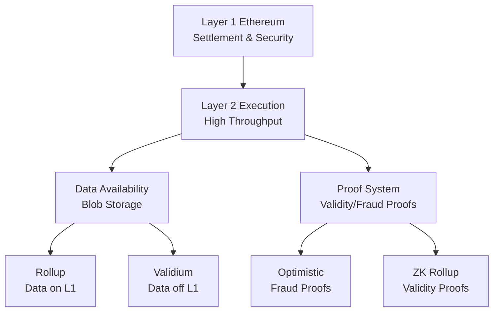

# Layer 2 Blockchains

Layer 2s (L2) enable a hierarchical approach to scaling, where a secure base layer 
(L1) provides settlement and security guarantees, while specialized secondary protocols handle the bulk of transaction execution.

The emergence of L2s was a recognition that the blockchain scalability trilemma, a balancing act between decentralization, security, and throughput, requires architectural solutions. For researchers, understanding L2s means grasping the fundamental design philosophies that make scalable decentralized systems possible.

## The Scalability Imperative

L2 solutions exist to solve a fundamental bottleneck in blockchain architecture. In a L1 network like Ethereum, every node must process, validate, and store every transaction. This creates a throughput ceiling limited by the least powerful node the network wishes to support.

The scalability trilemma posits a tension between decentralization (many participants can run nodes), scalability (high transaction throughput), and security (resistance to attack). Traditional scaling approaches often compromised one dimension, for example, by reducing validator count or weakening security assumptions.

With L2s, most transaction processing occurs offchain while still deriving security guarantees from the underlying L1. This allows the base layer to maintain decentralization and security while enabling higher throughput on specialized *secondary* chains.

## Core Architecture and Design Principles

### Assumptions

The L2 design space is built on a few core assumptions:

1.  **A Robust L1:** The design assumes the underlying L1 provides a censorship-resistant settlement layer to act as the ultimate arbiter of disputes. This requires the L1 to prioritize decentralization and security over its own throughput.
2.  **Reliable Proof Systems:** It assumes proof systems, whether optimistic fraud proofs or zero-knowledge validity proofs, can reliably secure offchain computation.
3.  **Separation of Concerns:** Data availability is treated as a separate problem from data processing. While every node doesn't need to *execute* every transaction, the data required to reconstruct the state must be available for verification.
4.  **Economic Security:** Game-theoretic incentives, such as slashing conditions in optimistic systems or the cryptographic guarantees of ZK proofs, are structured to ensure rational actors behave honestly or face economic penalties.

### The Rollup Paradigm

The term "rollup" captures the essential mechanic: transactions are executed offchain but "rolled up" and committed to the L1 in batches.

This model provides two primary benefits. First, it maintains the security properties of the L1 by ensuring all transaction data is eventually posted to the base layer. This property, known as **data availability**, is the defining feature of a true rollup. It guarantees that even if all L2 operators disappear, users can still reconstruct the state and withdraw their funds using only the data on L1.

Second, batch processing creates massive efficiency gains. Instead of forcing the L1 to process thousands of individual transactions, a rollup can execute them offchain and submit a single, compressed transaction to the L1 representing their net effect. This reduces the computational load on the base layer while preserving verifiability.

Crucially, rollups also inherit the decentralization and censorship resistance of the underlying L1. If an operator attempts to censor users, they can force their transactions to be included by submitting them directly to the L1 via a "forced inclusion" mechanism.

## Data Availability: The Foundation of Security

Data availability is the most critical architectural decision in L2 design, as it dictates the system's security guarantees and trust assumptions. It is the bridge between off-chain execution and on-chain security.

In a true rollup, transaction data is posted directly to L1, typically in a compressed form. This offers the strongest security guarantees, as L1 validators can always verify L2 operations and users can always reconstruct the state. However, posting data to L1 blockspace is expensive. The introduction of EIP-4844 "blob" storage for Ethereum L2s created a dedicated, cheaper data layer that significantly reduces costs while maintaining strong on-chain data availability guarantees.

Not all L2s use on-chain data availability. **Validiums** and other hybrid approaches store transaction data off-chain, using mechanisms like a Data Availability Committee. This further reduces costs and increases throughput but introduces new trust assumptions. Users must trust that the data will remain available, and the system becomes vulnerable to data withholding attacks.

This creates a spectrum of designs. Pure rollups prioritize security and trustlessness at the cost of higher fees. Validiums prioritize performance but introduce new trust assumptions. For a researcher, understanding a system's data availability model is the key to understanding its fundamental security properties.

## The Economic Challenge: ETH Value Accrual in an L2 World

A critical challenge facing Ethereum's rollup-centric roadmap is ensuring that ETH continues to accrue value as activity migrates to L2s. Vitalik Buterin's analysis in "Scaling Ethereum L1 and L2s in 2025 and beyond" identifies this as a key priority.

The tension is straightforward: as L2s dramatically lower transaction costs for users, L1 fee revenue declines, potentially undermining the security budget that protects the entire ecosystem. Buterin frames this as a "value accrual dilemma."

The proposed solutions are multi-pronged: cementing ETH as the primary asset across the entire L1+L2 economy, encouraging L2s to direct a percentage of their fees back to Ethereum (through burning or staking), and leveraging "based rollups" to allow the L1 to capture MEV. The scaling of blob space itself also becomes a revenue source—with 128 blobs per slot, Ethereum could burn up to 713,000 ETH annually, assuming consistent demand. However, this demand is not guaranteed, making a multi-faceted approach essential.

## The Data Availability Bottleneck and Blob Scaling

While EIP-4844's introduction of blobs was a major milestone, it represents a starting point, not an endgame. Today, Ethereum provides approximately 32 kB/sec of dedicated data space for rollups, which, as Vitalik's analysis shows, is barely enough for the current L2 ecosystem.

The math is stark: current blob capacity limits rollups to a combined ~174 TPS. Even with planned upgrades like Pectra (6 blobs) and PeerDAS (8-16 blobs), the theoretical maximum only reaches 463–926 TPS—far short of the 100,000+ TPS goal.

The roadmap presents three potential paths forward, each with distinct tradeoffs:
1.  **2D Data Availability Sampling (DAS):** The ideal solution, reaching the target of 16 MB/slot and enabling ~58,000 TPS.
2.  **1D DAS:** A simpler, more robust implementation that sacrifices efficiency and accepts a lower throughput ceiling.
3.  **Plasma:** A radical pivot away from on-chain data availability toward Plasma-based architectures.

This choice highlights a core tension between complexity, security, and scalability. As noted by inevitableeth.com, the current situation creates a "data availability bottleneck," where rollups solve for execution costs but exacerbate the problem of data storage costs.

## Cultural Extensions and Organizational Benefits

Perhaps the most underappreciated aspect of L2s is not technical but cultural. Vitalik's analysis of "Layer 2s as cultural extensions of Ethereum" argues that the L2-centric model allows for the creation of independent sub-ecosystems that are simultaneously autonomous and part of the greater Ethereum network.

This organizational structure creates powerful incentives for permissionless innovation. Unlike an L1 feature, which requires broad consensus from core developers, an L2 can be deployed by anyone. This allows teams to experiment with radical ideas, from novel virtual machines to entirely new economic models, without needing ecosystem-wide approval.

This fosters a diverse cultural landscape. Each L2 develops its own community, values, and focus: Optimism champions retroactive public goods funding, Polygon targets mainstream enterprise adoption, and Starknet explores advanced cryptographic frontiers. This pluralism is a strategic advantage, allowing Ethereum to cater to a wide range of use cases and risk appetites while maintaining shared security.

## The Sophistication of Rollup Taxonomy

The term "Layer 2" encompasses a sophisticated spectrum of designs. In "Different types of layer 2s," Vitalik Buterin provides a precise taxonomy that moves beyond simple labels.

A **true rollup** is defined by three properties:
1.  Full transaction data is posted to L1.
2.  The L2's state can be verified using only data available on L1.
3.  Users have a mechanism to force transaction inclusion, bypassing L2 operators.

This definition distinguishes rollups from other scaling solutions. **State channels**, for example, require a fixed set of participants who must remain online. **Plasma** systems use child chains but rely on external data availability and complex exit games. **Validiums** use validity proofs for execution but store data off-chain, introducing trust assumptions around data availability.

New hybrid models are emerging. **Volitions** allow users to choose their data availability model on a per-transaction basis, opting for either rollup-mode (on-chain data) or validium-mode (off-chain data). **Sovereign rollups** post data to an L1 but manage their own execution and dispute resolution. **Based rollups** leverage L1 block proposers as sequencers, eliminating the need for a separate sequencer set.

## Cross-L2 Interoperability: The Coordination Challenge

The greatest obstacle to a seamless L2 ecosystem is not technical but social: coordination. Today, navigating between L2s is a fragmented experience that undermines the vision of a unified Ethereum.

The pain points are concrete. Moving assets between L2s often requires centralized bridges. Smart contract wallet users must manage keys and accounts on each L2 independently. And despite robust light clients for Ethereum's L1, most L2s still rely on centralized RPC providers for data access.

The roadmap to solve this involves coordinated ecosystem-wide efforts. **Chain-specific addresses** would embed a chain identifier, allowing wallets to abstract away the complexity of cross-chain sends. Standardized, trust-minimized bridges and message-passing protocols would replace the multisig-based bridges that Vitalik has called "NOT acceptable."

**Keystore wallets** offer an elegant solution to account management, allowing keys stored on one chain (e.g., L1) to control accounts across all L2s via standardized read mechanisms like `L1SLOAD`. This turns an N-chain problem into a single-chain one. Successfully implementing these solutions will test the ecosystem's ability to cooperate and maintain unity.

## Optimistic vs. Zero-Knowledge: Philosophical Divides

The choice between optimistic and zero-knowledge rollups reflects a deeper philosophical split on how to approach trust, verification, and user experience.

**Optimistic rollups** operate on a "trust but verify" model. They assume state transitions are correct by default and rely on a challenge period (typically seven days) where observers can submit fraud proofs to revert invalid transactions. This approach is computationally light and generally EVM-compatible, making it easier to implement. However, it comes with a significant UX tradeoff: the challenge period means users must wait a week for their withdrawals to achieve L1 finality. While liquidity providers can offer fast exits for a fee, the underlying latency is a fundamental limitation.

**Zero-knowledge rollups** take a "don't trust, cryptographically verify" approach. They generate validity proofs for every batch of transactions, allowing the L1 to instantly verify the correctness of state transitions. This provides immediate finality for withdrawals and eliminates the liveness assumptions required for fraud proofs. ZK rollups also offer powerful privacy features. The drawback is computational intensity; generating ZK proofs is resource-intensive, making sequencer infrastructure more complex and expensive.

The future is unlikely to be a winner-take-all scenario. Instead, we are seeing a convergence, with hybrid systems like "optimistic ZK" rollups emerging to combine the strengths of both approaches.

## The Plasma Revival

The maturation of ZK proofs has enabled a renaissance in **Plasma**, a scaling architecture that offers rollup-like security with off-chain data availability. Modern Plasma designs are a significant improvement over early iterations.

The key insight is that Plasma doesn't need to be a perfect, all-encompassing solution. Even a system that only protects a subset of assets (e.g., tokens that haven't moved recently) is a major improvement over a validium, which offers no data availability guarantee at all.

Hybrid plasma/rollup constructions like Intmax are exploring this design space. By posting a minimal amount of data per user on-chain (as little as 5 bytes), these systems can achieve immense scalability and privacy while retaining a secure anchor to the L1. This generalized approach allows for nuanced designs optimized for specific use cases, rather than forcing a one-size-fits-all model.

## Architectural Insights: Sequencer Design

The sequencer is the heart of a rollup, responsible for ordering transactions, executing state transitions, and posting data to the L1. Its design is a critical architectural decision that determines the L2's decentralization, liveness, and censorship resistance.

Most current rollups use a **centralized sequencer**, which offers high performance and a simple user experience but creates a single point of failure and a potential vector for censorship. While mechanisms like forced inclusion can mitigate these risks, sequencer centralization remains a significant departure from core blockchain principles.

**Decentralizing the sequencer** involves complex tradeoffs. A decentralized sequencer set can improve censorship resistance but may introduce consensus overhead, increase latency, and add complexity. Researchers are exploring various models, including leader rotation schemes, committee-based ordering, and shared sequencing, where multiple L2s use a common set of sequencers.

**Based rollups** offer a particularly compelling alternative by leveraging the L1's block proposers as sequencers. This elegantly solves the decentralization problem by inheriting the L1's validator set, but it may also introduce latency and reduce the L2's flexibility.

## The Glue and Coprocessor Pattern

An architectural pattern emerging from modern computing, the "glue and coprocessor" model, offers a useful lens for L2 design. This pattern separates computation into two parts: a general-purpose "glue" component (high generality, low efficiency) and specialized "coprocessor" components (low generality, high efficiency).

This is seen in AI (Python as glue, GPUs as coprocessors) and increasingly in blockchains (the EVM as glue, precompiles for cryptography as coprocessors). For L2s, this suggests that the core virtual machine can be optimized for developer familiarity and security, while the most resource-intensive operations—like proof generation and state-tree updates—can be handled by highly optimized, specialized components.

This model reframes debates about VM efficiency. An "inefficient" but familiar VM like the EVM can achieve high performance by offloading heavy computation to dedicated coprocessors, all while retaining the immense benefits of its existing ecosystem and tooling.

## Economic Mechanisms and Sustainability

The long-term sustainability of any L2 depends on carefully designed economic mechanisms that align incentives and create a viable business model.

L2 fee markets are complex, as they must cover both L2 operational costs (sequencing, proving) and L1 data posting costs. The fee mechanism must balance user experience (low, predictable fees), sustainability (sufficient revenue for operators), and security (incentives for honest behavior). Many L2s have adopted EIP-1559-style markets to improve fee predictability.

The relationship between L1 and L2 fee markets creates a dynamic where L2s compete for users while collectively paying for L1 security. This incentivizes L2s to be as efficient as possible with their use of L1 data, driving innovation in compression and data management.

## The Future Architecture: Integration and Specialization

The L2 landscape is evolving toward both specialization and integration. We will likely see a diverse ecosystem of specialized L2s, each tailored to different use cases—from high-frequency finance to decentralized social media—all connected through standardized, trust-minimized interoperability protocols.

The maturation of ZK proofs will continue to unlock new possibilities for privacy and scalability. Modular blockchain architectures, which separate functions like execution, settlement, and data availability into distinct layers, will allow for even more customized L2 designs.

The relationship between L1 and L2 will also continue to co-evolve. The L1 will become increasingly optimized as a secure settlement and data availability layer, while L2s serve as the primary environment for user interaction and application execution.

## Implications for Researchers and Builders

For researchers, the L2 space is a fertile ground for innovation where technical and social challenges are deeply intertwined. Several key insights emerge:

*   **No Universal Solution:** Different applications require different tradeoffs along the security, scalability, and decentralization spectrum. The goal is not to find a single "best" L2 but to build a diverse ecosystem.
*   **Rapid Innovation:** Today's impossibilities may be tomorrow's common practice. This demands flexible, modular designs that can adapt as the underlying technology evolves.
*   **Interdisciplinary Approach:** The most powerful innovations emerge from combining insights from cryptography, distributed systems, economics, and user experience design.
*   **Coordination is Key:** Solving social coordination problems is as important as solving technical scalability problems for the ecosystem's long-term success.

The Layer 2 space represents a unique opportunity to design the fundamental infrastructure for a more decentralized internet. Understanding these core principles and tradeoffs provides the foundation needed to contribute to this exciting and rapidly evolving field.