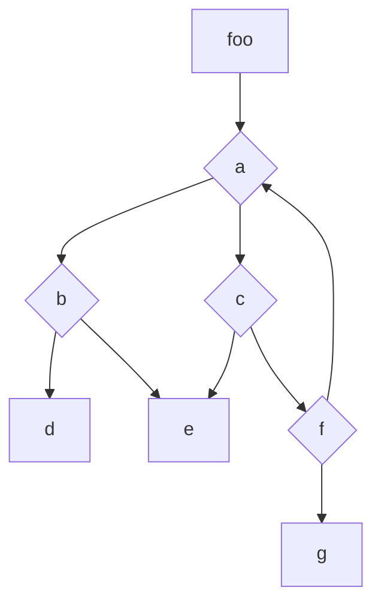
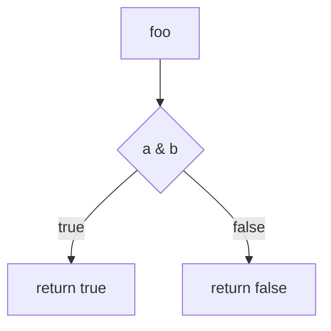
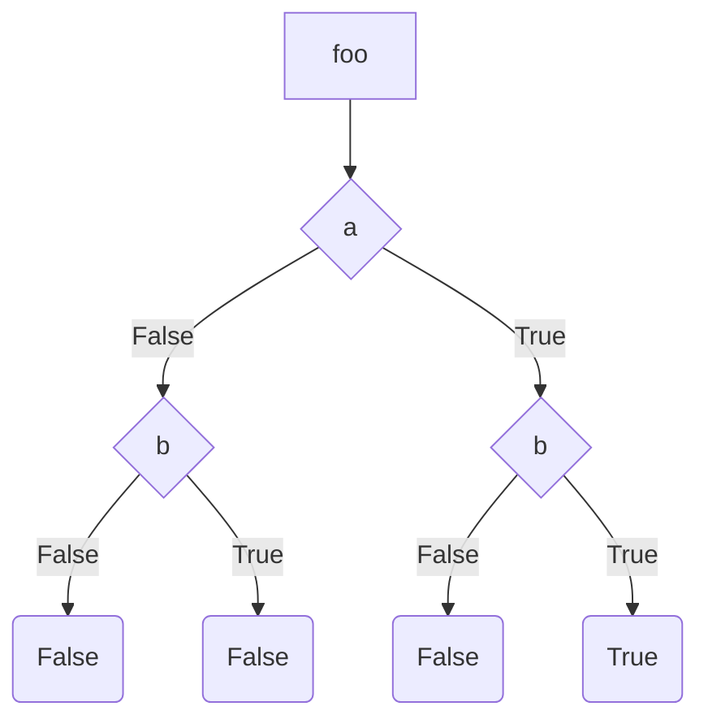
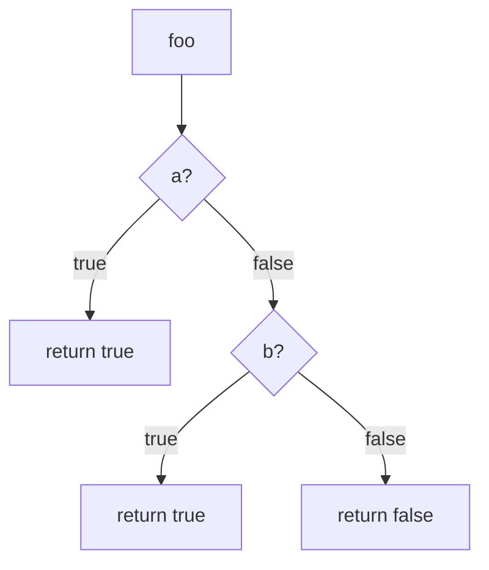

# Unit Integration Testing

## Or how I learned to stop worrying and love the tests

Testing is everyone's responsibility at Wonderland. We do not merge pull requests that aren't properly tested, "properly" as in "having relevant and meaningful tests." During a project's implementation, we write two types of tests: unit tests and integration tests.

## Unit test

A "unit" is defined as the smallest piece of logic in a system. In a protocol built from smart contracts, we define functions as units. A unit test's purpose is to test the behaviour of this unit in every possible scenario. To do so, we isolate the unit by _mocking_ any external dependencies (solitary testing), then study and test every _branch_. The number of branches tested is expressed as the test _coverage_. We'll explain these concepts and how we approach them at Wonderland.

### Mocking

Mocking is the process of creating and returning an arbitrary value when an external dependency is used. As we use Forge, we have a cheat code that makes this process pretty straightforward: `vm.mockCall(target address, calldata, returned value)`.

The target address is the address where the mocked contract lives. This is usually an arbitrary address where nothing is deployed, calldata is the selector + data used to call this address (we strongly recommend using `abi.encodeCall` instead of `encodeWithSelector` or `encodeWithSignature`, as it greatly reduces the risk of errors in the type of the arguments or the function name), and the returned value is the value the mock is going to return to the unit we're testing.

Since a call to an external contract is a part of the expected behaviour of the unit, we usually pair the `mockCall` cheat code with `vm.expectCall(target address, call data)`. This will make the test fail if no call with the specified data is made to the mock address.

Using cheat codes, we avoid having `MockContract`, which introduces foreign logic into or around the unit we're testing.

<aside>
💡

Not all logic can be mocked. One notorious exception is multiple calls to the same function, which should return different values - for example, `balanceOf` calls sandwiching a transfer. Using a mock contract, with as little logic as possible, is then necessary.

</aside>

### 📝 Exercise: spot which part of this unit would require being mocked.

📝 Bonus: write these mocks - do not forget to`expect` these calls, too!

```solidity
IERC20 token;
IVault vault;
mapping(address owner => uint256 bonuses) bonusOf;

constructor(IERC20 _token, IVault _vault) {
    token = _token;
    vault = _vault;
}

function foo(uint256 input) external {
    uint256 bonus = 1;
    if(token.balanceOf(msg.sender) > 10 ether) bonus = vault.bonus(input);
    bonusOf[msg.sender] = bonus;
}
```

<details>
<summary>✅ Solution</summary>
    
    There are 2 external calls which must be mocked: `token.balanceOf` and `vault.bonus`.
    
    Here are the mocks, using `abi.encodeCall` to generate the calldata:
    
    ```solidity
    // Assuming we want to test a balance of 15e18
    vm.mockCall(address(token), abi.encodeCall(token.balanceOf, (address(this))), 15 ether)
    
    // Assuming we test an input of `2` and the vault.bonus function has no return value
    vm.mockCall(address(vault), abi.encodeCall(vault.bonus, (2)), '')
    ```
    
    The expectCall is identical, without the returned values:
    
    ```solidity
    vm.expectCall(address(token), abi.encodeCall(token.balanceOf, (address(this))))
    vm.expectCall(address(vault), abi.encodeCall(vault.bonus, (2)))
    ```
    
    Here is how a test function would look (see the Bulloak section for the function skeleton generation).
    
    ```solidity
    function test_ifTokenBalanceIsGreaterThanTen() external {
        vm.mockCall(address(token), abi.encodeCall(token.balanceOf, (address(this))), 15 ether);
        vm.expectCall(address(token), abi.encodeCall(token.balanceOf, (address(this))));
    
        vm.mockCall(address(vault), abi.encodeCall(vault.bonus, (2)), '');
        vm.expectCall(address(vault), abi.encodeCall(vault.bonus, (2)));
    
        target.foo(1);
        (...)
    }
    
    ```
</details>

Another similar cheat code we use in our unit tests to check if an address has emitted a specific event is `vm.expectEmit(address)`. We tend to avoid using `vm.expectEmit(bool, bool,bool,bool)` or `vm.expectEmit(bool,bool,bool,bool,address)` that specifically matches topics, for better future-proofing (if an event signature changes and adds/removes some indexed parameters, for instance, it might break the test).

In practice, to avoid redundant mock/expectCall, we either use internal helpers for smaller mocks, or our dedicated mocking tool for more advanced functionalities: [Smock-foundry](https://github.com/defi-wonderland/smock-foundry).

Here is an example of such helper:

```solidity
// The internal helper
library Halp {
  Vm constant _vm = Vm(address(uint160(uint256(keccak256('hevm cheat code')))));

  function mockExpect(address _target, bytes memory _callData, bytes memory _returnData) internal {
    _vm.etch(_target, new bytes(0x1));
    _vm.mockCall(_target, _callData, _returnData);
    _vm.expectCall(_target, _callData);
  }
}

// Example of usage
contract UnitTest {
  using {Halp.mockExpect} for address;

  function test_GetTokenBalance(address _caller, uint256 _balance) public {
    address(_token).mockExpect(abi.encodeCall(IERC20.balanceOf, (_caller)), abi.encode(_balance));

    uint256 _readBalance = _token.balanceOf(_caller);
    assertEq(_balance, _readBalance);
  }
}

```

And its Smock equivalent:

```solidity
function test_GetTokenBalance(address _caller, uint256 _balance) public {
    _token.mock_call_balanceOf(_balance);

    uint256 _readBalance = _token.balanceOf(_caller);
    assertEq(_balance, _readBalance);
}

```

### Branch and path

Every function can be represented as a directed connected graph, starting from an entry-point, going through intermediary logic gates, and ending in an end state. This is called a control flow graph.
A set of edges going from the entry point to a given end-state is called a branch or a path.



$A \rightarrow C \rightarrow E$ is one branch of the `foo()` execution.

Example:

```solidity
function foo(bool x, bool y) returns (bool) {
    if (a && b) {
        return true;
    }
    return false;
}

```

And its control flow chart:



Coverage is a metric showing how much of our unit is actually "touched" by our test (see below "Coverage"). A control flow chart can be used to measure this, which is referred to as branch coverage. However, as in our example, it may miss some scenarios. For instance, only two cases are needed to test both branches here: `foo(true, true)` and `foo(false, false)`.

Every possible way to reach an end state is called a path. For our example, there are 4 paths with only 2 end states, which are the expression of the truth table of a^b (a AND b):

```markdown
| A   | B   | A and B |
| --- | --- | ------- |
| 0   | 0   | 0       |
| 0   | 1   | 0       |
| 1   | 0   | 0       |
| 1   | 1   | 1       |
```



Covering every possible path ensures no stone is left unturned, but, as a direct consequence, can dramatically increase the number of tests. Furthermore, if the unit has various independent conditions, this will lead to different paths which do not provide any new information when tested.

```solidity
function foo(bool x, bool y) returns (bool) {
    if (a) {
        return true;
    }

    if (b) {
        return true;
    }

    return false;
}

```



This flowchart is pretty straightforward branch-wise (there are 3 of them), but the corresponding paths should include, for a = true, b values in 2 different tests, even though the scenario a true/b false is, here, identical to a true/b true. Having both tests doesn't bring any new information.

[Here](https://stackoverflow.com/questions/49563130/coverage-branch-and-path-coverage-test-case) is an example to show the importance, when possible, of testing paths instead of branches.

```java
double method1(int m, int n) {
     double p;
     if (n >= 0) {
         p = m / n; // This will error for n==0
     } else {
         p = m / n;
     }

     if (n > 0) {
         p = m / n;
     } else {
         p = m / n;
     }

     return p;
}

```

Path coverage should cover n > 0, n == 0, and n < 0, and therefore throwing on division by 0 on the first if. Branch coverage, on the other hand, is achieved with n = 1 and n = -1, and the test would never reveal this possible division by 0.

In summary, if there are no independent control structures, testing all paths is preferred, while having independent conditions makes us test the branches instead.

<aside>
⚠️

While we present an approach where the implementation dictates the test, this is only for clarity. If possible, the opposite approach should be preferred (getting close to the practice of [Test Driven Development](https://en.wikipedia.org/wiki/Test-driven_development) TDD): start from the unit's supposed logic ("this function should do X and Y, and if I do Z, it should return" then write the corresponding tree, then apply TDD principles and implement/test) - see infra "Bulloak" for further reading about BTT/trees and use in a TDD approach.

</aside>

📝 Exercise: For each function, draw the control flow chart, list its branches and paths, then decide which testing approach you would use.

```solidity
function foo(uint256 in) external returns(bool) {
    if(in >> 4 != 0) return true;
    else return false
}
```

<details>
<summary>✅ Solution</summary>    
    There are 2 branches and 2 identical paths. Testing both is ideal.
</details>

```solidity
function foo(uint256 in) external returns(uint256) {
    if(in > 4) return 1;
    if(in > 5) return 2;
    if(in > 6) return 3;
    return type(uint256).max;
}
```

<details>
<summary>✅ Solution</summary>
    There are 4 branches (input less than or equal to 4, greater than 4, greater than 5, and greater than 6). The input being the only function parameter, these branches are paths too and should all be tested.
</details>

```solidity
function foo(uint256 in1, uint256 in2) external returns(uint256) {
    if(in1 > in2) return 1;
    if(in1 == in2) return 0;
    return type(uint256).max;
}
```

<details>
<summary>✅ Solution</summary>
    There are 3 branches corresponding to the 3 returns in this example. There are equally 3 paths.
</details>

```solidity
function foo(uint256 in1, uint256 in2) external returns(uint256) {
    uint256 tmp;
    if(in1 > 100) tmp++;
    if(in2 > 100) tmp++;
    return tmp;
}
```

<details>
<summary>✅ Solution</summary>
    
    There are 2 branches corresponding to the 2 if's but 4 paths: in1 lte or gt 100, and in2 lte or gt 100. Even though the ifs look independent, they have an effect on the same underlying variable `tmp` and are therefore not. The 4 paths should be tested.
</details>

```solidity
function foo(uint256 in1, uint256 in2) external returns(bool) {
    if(in1 > 100) return true;
    if(in2 > 100) return true;
    return false;
}
```

<details>
<summary>✅ Solution</summary>
    
    There are 3 branches and 4 paths. The 2 ifs are here independents, i.e. in1 has no influence on in2, and therefore testing every paths is not bringing any new meaningful information.
    Here, the paths taken in `foo(500, 1)` and `foo(500, 500)`, even though different, are not useful to test, because with the first if being true, in2 has no effect.
</details>

### Coverage

We use branch coverage as a discovery tool to assess our current unit tests. To maximise its scope, we use the branched-tree technique with Bulloak.

The coverage measures 'something' being touched by our tests. This something can be the statements, the lines, the function, the branches or the paths. The coverage is measured across all contracts from the project, with the contracts not tested yet having a coverage of 0% in all categories.

We use `forge coverage` to measure coverage. It run the tests and returns 4 measures:

- `% Lines`: the portion of line from the source file which have been seen by the tests, i.e. the number of lines seen in X.sol divided by total number of lines in X.sol \* 100.
- `% Statements`: the portion of statements seen
- `% Branches`: the portion of branches seen
- `% Funcs`: the portion of function seen

Note that forge includes by default every contract run during the tests, including the tests themselves or the scripts - these can be safely discarded. Alternatively, you could use the `--match-path` parameter and other similar options for better precision.

To efficiently spot where the holes in our coverage are, we can use the [Coverage Gutter](https://marketplace.visualstudio.com/items?itemName=ryanluker.vscode-coverage-gutters) VSCode extension or any other coverage tool supporting the lcov format, and export the coverage results in lcov by running `forge coverage --report lcov`.

We use the branches coverage as a guiding tool, as it carries the most information possible. We want to hit 100% of branches coverage by the end of the development phase, taking into account 2 factors:

- in rare cases, some branches are considered as unreachable
- getting to 100% can be sometimes tedious or pointless. During active development, the main objective is therefore to aim for _meaningful_ unit tests instead. Coverage might be, temporarily, non maximal, but both expected behaviour and edge cases are tested, allowing further iteration around the unit.

In Summary, we use coverage as a _discovery tool_ instead of a _performance indicator_, a non-maximal coverage should always be investigated (while a 100% on all metric is not carrying much information).

## Bulloak

To ease the coverage maximization, we use the branched-tree technique with Bulloak. This technique aims to list the paths or branches in a systematic way.

To write a new unit test, we start by writing its corresponding .tree file. This file will list either the branches or the paths we'd like to explore in our test. Having them listed allows to easily cover them all, and reach 100% coverage.

A .tree file is build by first using `#` structure, with the special `When`, `Given` and `It` keywords. For clarity's sake, when using Bull-oak for scaffolding, there should be no underscore in the Given/When conditions.

`Given` is used to set the initial state of the unit, its context, `When` is used to define the action (sending ETH, calling a function, etc) and `It` is used to define the expected outcome, which can be multiple.

```
Foo::myFunc()
# Given sender is owner
## When sending eth
### It should wrap the eth
### It should update the vault
### It should call _claim
## When not sending eth
### It should revert
# When sender is not the owner
## It should revert
```

Special char cannot be part of the `when`/ `given` conditions, underscore and digits should be avoided. Math formula can be as child to the `it` though. Even if vscode complains, it works, as showcased in Bulloak readme.

Using [Ascii Tree Generator vscode plugin](https://marketplace.visualstudio.com/items?itemName=aprilandjan.ascii-tree-generator) or any equivalent online service like [text tree generator](https://www.text-tree-generator.com/), you can create a proper tree file. This file should be named according to the guidelines and left in the unit test folder.

```
Foo::myFunc()
├── Given sender is owner
│   ├── When sending eth
│   │   ├── It should wrap the eth
│   │   ├── It should update the vault
│   │   └── It should call _claim
│   └── When not sending eth
│       └── It should revert
└── When sender is not the owner
    └── It should revert
```

From this file, using `bulloak scaffold path/to/file.tree -S`, the following unit test skeleton is generated:

```solidity
// SPDX-License-Identifier: UNLICENSED
pragma solidity 0.8.0;

import {Test} from "forge-std/Test.sol";

contract FoomyFunc is Test {
    modifier WhenSenderIsOwner() {
        _;
    }

    function test_WhenSendingEth() external WhenSenderIsOwner {
        // It should wrap the eth
        // It should update the vault
        // It should call _claim
        vm.skip(true);
    }

    function test_WhenNotSendingEth() external WhenSenderIsOwner {
        // It should revert
        vm.skip(true);
    }

    function test_GivenSenderIsNotTheOwner() external {
        // It should revert
        vm.skip(true);
    }
}
```

Always use the `-S` flag with Bulloak, in order to include `vm.skip(true)` on every empty test function (without it, these test would count as passing). Use the -s 0.8.20 flag to include a specific solidity version in the pragma directive (useful for multiple test files, when running `scaffold *.tree`) and `-w` to write the test file in a .sol, following the .tree naming.

Bulloak will generate one test file per .tree file, if a given contract has functions with heavy logic, we split the .tree to include only one function per file, for example named `contract_functionName.tree`. Bulloak can be run using `scaffold *` to generate all test files, skipping the pre-existing ones.

### Updating trees

If an unit behavior changes during development, the related tests might not be accurate anymore. If the tree is still relevant, then only the test implementation has to be reviewed and updated. On the other hand, if the tree is not relevant anymore, it should be updated to reflect the new behavior too.
In order to do so, the tree should be updated first. To easily update the tree, use the 'From tree to string' option in the Ascii Tree Generator, modify the string, then use the 'From string to tree' option to get the new tree. From there, running `bulloak scaffold` will throw (as the test files already exist) - using `--force-write` would erase all existing tests - instead, use `bulloak check --fix`. This will check the existing test files, find the differences and fix them.

Alternatively, running Bulloak without `-w` will output the scaffolded test in the console, which can then be copied/updated accordingly.

### TDD in a BTT-lead test suite

The tree can be seen as a concise but exhaustive design document. It, therefore, makes sense to use it as such and adopt a TDD approach to the development and test. The "3 Laws of TDD" ("You are not allowed to write any production code unless it is to make a failing unit test pass - You are not allowed to write any more of a unit test than is sufficient to fail, and compilation failures are failures - You are not allowed to write any more production code than is sufficient to pass the one failing unit test." - Clean Code, R. Martin) are the used, which leads to the following steps of short-lived repeated iterations:

1. Start by writing the tree of the unit
2. Pick one of the tree branches
3. Write a single test that fails, based on that branch (compilation error counts as failing)
4. Write the code that makes that test pass, _and nothing more_
5. If not covering every branch, go to 2.

### Internal functions

Internal function testing might not be as straightforward as their external counterpart, as they're, well, internal to the contract. Even though internal and private functions are rather considered as implementation details in the software industry and not tested in isolation, we test them via a dedicated contract. This comes with an testing overhead when refactoring an unit, as there is a tighter coupling between the code and the test suite, which then needs refactoring too, but ease writing the initial unit tests.

<!-- See the [Foundry's book related chapter](https://book.getfoundry.sh/tutorials/best-practices#internal-functions) for more tips and tricks. -->

### Fixtures

There is now [a foundry book part](https://book.getfoundry.sh/forge/fuzz-testing?highlight=fuzz) about fixtures and how one can create such.

## Integration tests

While unit tests are studying the behaviour of an unit in _solitary_ testing, unforeseen bugs might arise from interaction between multiple well-tested units. This is why we include integration tests in our development phase.

Integration tests are focused on studying how our units interact with each other or with external dependencies and protocols. They, therefore, don't focus on having every branches of every unit covered, because unit tests are already providing this information, and use another approach: happy and sad paths.

Every regular use-case of the protocol should be covered in these tests, whether they are the normal, intended, way of working (happy path) or the most common errors (sad paths).

```solidity
contract Foo {
    function foo() external {
        if(!Bar(address).prepareBar) revert();
        doSomething();
    }
}

contract Bar {
    bool prepareBar;

    function bar() external {
        if(!prepareBar) revert();
        doSomeStuff();
        Foo(address).foo();
    }

    function baz() external {
        prepareBar = true;
    }
}

```

In this example, the happy path would be the sequence `baz()` `bar()` while a sad path is calling `bar()` only or `foo()` only.

## Fuzzed variables

We use fuzzed variables in our tests, to cover a range of value corresponding _to a single branch or path_ in an unit or integration tests.

What is fuzzing and how does it work? When adding a fuzzed variable to a test, there is no magic value used while writing it. Instead, forge will execute the same test an arbitrary number of times (256 by default) with a different value for this variable on each pass. One of these test iteration is called a "run". The underlying process is handled by a runner, which is outside the scope of this guide, see the amazing [Fuzzing Book](https://www.fuzzingbook.org/) for more general consideration on fuzzed tests.

To fuzz a variable in forge, it only needs to be declared as a parameter of the test function, forge will automatically pick it up and fuzz it:

```solidity
function test_foo(uint256 fuzzMeDaddy) external {
    // test some stuff, with fuzzMeDaddy taking different values.
}

```

The value for a given run is picked from a dictionary of values based on [3 sets](https://github.com/foundry-rs/foundry/blob/31c13dce772cccb4d4b7adfb2f366c9d8276ebc5/crates/evm/fuzz/src/strategies/uint.rs#L69): purely random values with a seed fixed for coverage and gas snapshot, boundary cases (for uint, +/-3 from 0 and the max value), and an optional used-defined array, called fixture. This can be tweaked in the `foundry.toml`. See the [Foundry Book's relevant chapter](https://book.getfoundry.sh/reference/config/testing?fuzz#fuzz) and [how to define fixtures](https://book.getfoundry.sh/forge/fuzz-testing?highlight=fuzz%20rung#fuzz-test-fixtures).

While fuzzing a variable is quite easy, care must be taken of doing it properly and avoid potential foot gunning.

We fuzz various variable to cover a range of values which are contained within a branch. We don't test multiple branches or paths based on the values of a given run, for example `if myFuzzedVar > 5 assert A, else asset B` is a NoGo. We do this as, for this kind of "simple" dynamic tests, we only have a few number of run (1000 by default, meaning 1000 values are tested), having multiple branches tested further divide this pool of values.

In order to stay within a branch, we have to crop the values from every run. To do so, we use forge-std's `bound` and NOT the `vm.assume` cheatcode as sometimes referred, for the same reason as above - `vm.assume` drops the current run and start a new one, while bound will modify the value received then execute the test. Too many runs excluded will either slow the tests a lot, or make them fail after a set threshold of rejected runs.

```solidity
function test_foo(uint256 fuzzMeDaddy) external {
    // This will use only value between 0 and 100 in our runs
    fuzzMeDaddy = bound(fuzzMeDaddy, 0, 100);
    // test some stuff, with fuzzMeDaddy taking different values.
}
```

Another trick for restricting the range of values for numeric types is to use a smaller type as parameters. Solidity will automatically upcast if needed.

```solidity
function test_foo(uint8 fuzzMeDaddy) external {
    // test some stuff, with fuzzMeDaddy taking values between 0 and max uint8
    // even if used as an uint256 in the test function body
}
```

📝 Exercise: how would you transform these tests into fuzzed ones?

```solidity
bool witness;

function foo(uint256 _in1, uint256 _in2) public {
    if (_in1 >= _in2) witness = true;
    else witness = false;
}

function test_fooWhenOneIsBigger() external {
    uint256 inputOne = 100;
    uint256 inputTwo = 50;

    foo(inputOne, inputTwo);

    assertTrue(witness);
}

function test_fooWhenOneIsEqual() external {
    uint256 inputOne = 100;
    uint256 inputTwo = inputOne;

    foo(inputOne, inputTwo);

    assertTrue(witness);
}

function test_fooWhenOneIsSmaller() external {
    uint256 inputOne = 50;
    uint256 inputTwo = 100;

    foo(inputOne, inputTwo);

    assertFalse(witness);
}
```

<details>
<summary>✅ Solution</summary>
    
    The condition being greater than or equal (`>=`), both cases are in the same paths (and can be part of the same range of fuzzed values).
    
    ```solidity
    bool witness;
    
    function foo(uint256 _in1, uint256 _in2) public {
        if (_in1 >= _in2) witness = true;
        else witness = false;
    }
    
    function test_fooWhenOneIsBiggerOrEqual(uint256 inputOne, uint256 inputTwo) external {
        inputTwo = bound(inputTwo, 0, inputOne);
    
        foo(inputOne, inputTwo);
    
        assertTrue(witness);
    }
    
    // To have strictly smaller, we need to start our range for inputTwo at 1 (so 0 can be smaller)
    function test_fooWhenOneIsSmaller() external {
        inputTwo = bound(inputTwo, 1, type(uint256).max);
        inputOne = bound(inputOne, 0, inputTwo - 1);
    
        foo(inputOne, inputTwo);
    
        assertFalse(witness);
    }
    ```
</details>

Avoiding `vm.assume` (and maintaining a decent number of runs) is crucial to the test accuracy. See this counter-example that demonstrates the absence of an integer divisible by 10…


This is a practical guide on how we write our tests during the development of a project. For more advanced testing technique and tools, that we use at the end of our projects, see the "advanced tests" article.
